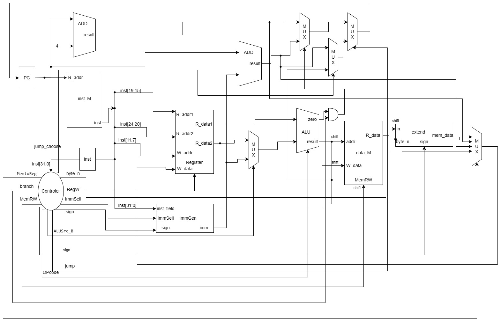
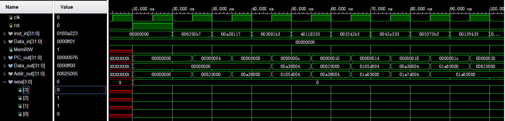
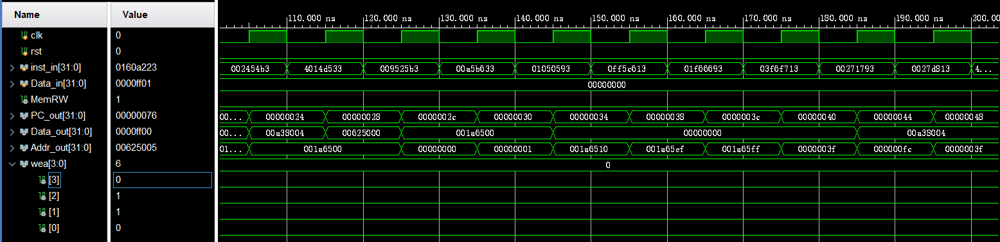
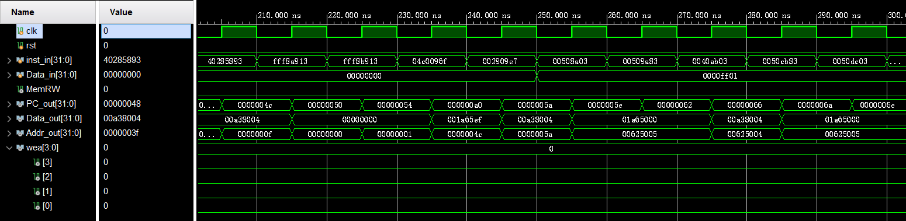
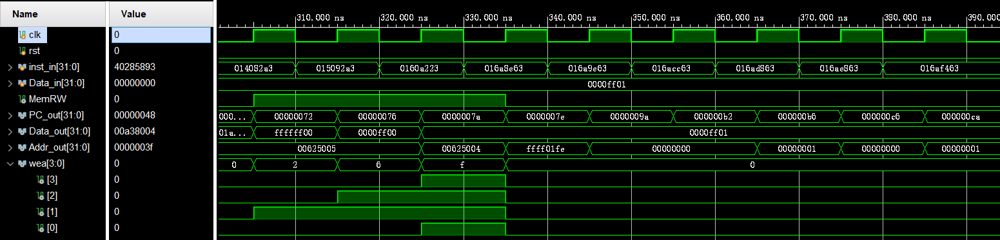
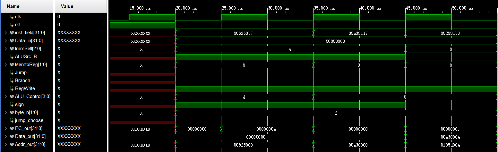
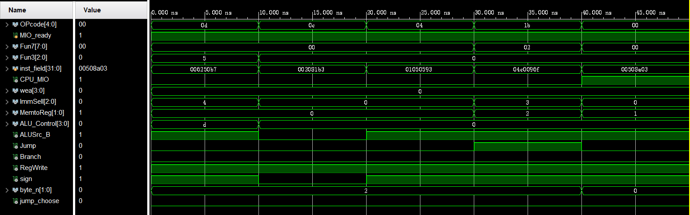

# 浙江大学实验报告
**专业：计算机科学与技术&emsp;姓名：仇国智&emsp;学号：3220102181&emsp;日期：2024/4/10 
课程名称：计算机组成与设计&emsp;实验名称:实现单周期 CPU-指令拓展&emsp; 指导老师：刘海风&emsp;成绩：**
## 操作方法与实验步骤
### 绘制Datapath图

### 源文件编写
将原来lab2的工程复制一份,删除  `SCPU`  模块,依据原理图,自行设计  `SCPU`  模块(下辖  `ALU`  , `Controler` , `Datapath` , `extend` , `ImmGEN` , `Regs` 模块, `ALU` , `Regs` 已经在前面实验实现,可直接复制)
#### `SCPU` 模块 
`SCPU` 模块主要连接 `Controler` 和 `Datapath` 模块,并且包含了 `Inst` 指令的寄存器(实际上应该把 `Regs` 和 `PC` 的寄存器都拉到 `Datapath` ,这样结构会更加清晰),还计算了 `MemRW` (实际上这个变量没有必要存在),,同时对 `Data_out` 和 `wea` 进行了左位移偏移处理(因为 `RAM` 的地址是四字节对齐的,所以会对 `Addr_out` 造成截断, `Data_out` 和 `wea` 需要与截断后的 `Addr_out` 对齐,即代码 30 和 31 行).
```verilog
  `timescale 1ns / 1ps
  `include "Lab4.vh"
  module SCPU (
    `RegFile_Regs_Outputs
    input clk,
    input rst,
    input MIO_ready,
    input [31:0] inst_in,
    input [31:0] Data_in,
    output CPU_MIO,
    output MemRW,
    output wire [31:0] PC_out,
    output [31:0] Data_out,
    output [31:0] Addr_out,
    output wire [3:0] wea
  );
    wire [`IMM_SEL_WIDTH-1:0] ImmSell;
    wire ALUSrc_B;
    wire [`MEM2REG_WIDTH-1:0] MemtoReg;
    wire Jump;
    wire Branch;
    wire RegWrite;
    wire sign;
    wire jump_choose;
    // 0 1byte,1 2byte,2 4byte
    wire [1:0] byte_n;
    assign MemRW = |wea;
    wire [ 3:0] wea_temp;
    wire [31:0] Data_out_temp;
    assign wea = wea_temp << (Addr_out % 4);
    assign Data_out = MemRW ? (Data_out_temp << ((Addr_out % 4) << 3)) : Data_out_temp;
    wire [`ALU_OP_WIDTH-1:0] ALU_Control;
    reg [31:0] inst;
    always @(posedge clk or posedge rst) begin
      if (rst) begin
        inst <= 32'h0;
      end else begin
        inst <= inst_in;
      end
    end
    Controler v1 (
        .OPcode(inst[6:2]),
        .MIO_ready(MIO_ready),
        .Fun7(inst[31:25]),
        .Fun3(inst[14:12]),

        .wea(wea_temp),
        .CPU_MIO(CPU_MIO),
        .ImmSell(ImmSell),
        .ALUSrc_B(ALUSrc_B),
        .MemtoReg(MemtoReg),
        .Jump(Jump),
        .Branch(Branch),
        .RegWrite(RegWrite),
        .ALU_Control(ALU_Control),
        .sign(sign),
        .byte_n(byte_n),
        .jump_choose(jump_choose)
    );
    DataPath v2 (
        `RegFile_Regs_Arguments
        .clk(clk),
        .rst(rst),
        .inst_field(inst),
        .Data_in(Data_in),
        .ImmSell(ImmSell),
        .ALUSrc_B(ALUSrc_B),
        .MemtoReg(MemtoReg),
        .Jump(Jump),
        .Branch(Branch),
        .RegWrite(RegWrite),
        .ALU_Control(ALU_Control),
        .sign(sign),
        .byte_n(byte_n),
        .jump_choose(jump_choose),

        .PC_out  (PC_out),
        .Data_out(Data_out_temp),
        .Addr_out(Addr_out)
    );
  endmodule
```
#### `Controler` 模块
`Controler` :根据指令不同要求解码即可,下面是各个输出属性的解释.代码很繁杂,或许可以通过将指令的不同输入组合然后存入一个 `ROM` 中,然后通过 `OPcode` 和 `Fun7` 和 `Fun3` 确定指令索引以读入 `ROM` 中的数据,但这样会降低代码可读性.
-  `wea` : 写入地址选择
-  `ImmSell` : 立即数模式选择
-  `MemtoReg` : 写入寄存器数据来源选择
-  `ALU_Control` : ALU控制信号
-  `ALUSrc_B` : ALU第二个操作数来源选择
-  `Jump` : 是否跳转
-  `Branch` : 是否分支
-  `RegWrite` : 是否写入寄存器
-  `sign` : 字节/半字读入时是否进行有符号扩展
-  `byte_n` : 读入字节数
-  `jump_choose` : 跳转地址选择(PC+立即数/ALU输出)
```verilog
    `include "Lab4.vh"
    module Controler (
        input wire [4:0] OPcode,
        input wire MIO_ready,
        input wire [6:0] Fun7,
        input wire [2:0] Fun3,
        output reg CPU_MIO,
        output reg [3:0] wea,
        output reg [`IMM_SEL_WIDTH-1:0] ImmSell,
        output reg [`MEM2REG_WIDTH-1:0] MemtoReg,
        output reg [`ALU_OP_WIDTH-1:0] ALU_Control,
        output reg ALUSrc_B,
        output reg Jump,
        output reg Branch,
        output reg RegWrite,
        output reg sign,
        output reg [1:0] byte_n,
        output reg jump_choose
    );
      always @(*) begin
        case (OPcode)
          `OPCODE_ALU: begin
            CPU_MIO <= 1'b0;
            wea <= `WEA_READ;
            ImmSell <= 3'b0;
            MemtoReg <= `MEM2REG_ALU;
            case (Fun3)
              `FUNC_ADD: ALU_Control <= Fun7[5] ? `ALU_OP_SUB : `ALU_OP_ADD;
              `FUNC_SL: ALU_Control <= `ALU_OP_SLL;
              `FUNC_SLT: ALU_Control <= `ALU_OP_SLT;
              `FUNC_SLTU: ALU_Control <= `ALU_OP_SLTU;
              `FUNC_XOR: ALU_Control <= `ALU_OP_XOR;
              `FUNC_OR: ALU_Control <= `ALU_OP_OR;
              `FUNC_AND: ALU_Control <= `ALU_OP_AND;
              `FUNC_SR: ALU_Control <= Fun7[5] ? `ALU_OP_SRA : `ALU_OP_SRL;
              default: ALU_Control <= 4'b0;
            endcase
            ALUSrc_B <= 1'b0;
            Jump <= 1'b0;
            Branch <= 1'b0;
            RegWrite <= 1'b1;
            sign <= 1'b0;
            byte_n <= `WORD;
            jump_choose <= `JUMP_PC_IMM;
          end
          `OPCODE_ALU_IMM: begin
            CPU_MIO <= 1'b0;
            wea <= `WEA_READ;
            ImmSell <= `IMM_SEL_I;
            MemtoReg <= `MEM2REG_ALU;
            case (Fun3)
              `FUNC_ADD: ALU_Control <= `ALU_OP_ADD;
              `FUNC_SL: ALU_Control <= `ALU_OP_SLL;
              `FUNC_SLT: ALU_Control <= `ALU_OP_SLT;
              `FUNC_SLTU: ALU_Control <= `ALU_OP_SLTU;
              `FUNC_XOR: ALU_Control <= `ALU_OP_XOR;
              `FUNC_OR: ALU_Control <= `ALU_OP_OR;
              `FUNC_AND: ALU_Control <= `ALU_OP_AND;
              `FUNC_SR: ALU_Control <= Fun7[5] ? `ALU_OP_SRA : `ALU_OP_SRL;
              default: ALU_Control <= 4'b0;
            endcase
            ALUSrc_B <= 1'b1;
            Jump <= 1'b0;
            Branch <= 1'b0;
            RegWrite <= 1'b1;
            sign <= 1'b1;
            byte_n <= `WORD;
            jump_choose <= `JUMP_PC_IMM;
          end
          `OPCODE_LOAD: begin
            CPU_MIO <= 1'b1;
            wea <= `WEA_READ;
            ImmSell <= `IMM_SEL_I;
            MemtoReg <= `MEM2REG_MEM;
            ALU_Control <= 4'b0;
            ALUSrc_B <= 1'b1;
            Jump <= 1'b0;
            Branch <= 1'b0;
            RegWrite <= 1'b1;
            sign <= ~(Fun3 == `FUNC_BYTE_UNSIGNED || Fun3 == `FUNC_HALF_UNSIGNED);
            case (Fun3)
              `FUNC_BYTE, `FUNC_BYTE_UNSIGNED: byte_n <= `BYTE;
              `FUNC_HALF, `FUNC_HALF_UNSIGNED: byte_n <= `HALF;
              `FUNC_WORD: byte_n <= `WORD;
              default: byte_n <= `WORD;
            endcase
            jump_choose <= `JUMP_PC_IMM;
          end
          `OPCODE_STORE: begin
            CPU_MIO <= 1'b1;
            case (Fun3)
              `FUNC_BYTE: wea <= `WEA_BYTE;
              `FUNC_HALF: wea <= `WEA_HALF;
              `FUNC_WORD: wea <= `WEA_WORD;
              default: wea <= `WEA_READ;
            endcase
            ImmSell <= `IMM_SEL_S;
            MemtoReg <= `MEM2REG_MEM;
            ALU_Control <= 4'b0;
            ALUSrc_B <= 1'b1;
            Jump <= 1'b0;
            Branch <= 1'b0;
            RegWrite <= 1'b0;
            sign <= 1'b1;
            byte_n <= `WORD;
            jump_choose <= `JUMP_PC_IMM;
          end
          `OPCODE_BRANCH: begin
            CPU_MIO <= 1'b0;
            wea <= `WEA_READ;
            ImmSell <= `IMM_SEL_B;
            MemtoReg <= `MEM2REG_ALU;
            case (Fun3)
              `FUNC_EQ:  ALU_Control <= `ALU_OP_SUB;
              `FUNC_NE:  ALU_Control <= `ALU_OP_EQ;
              `FUNC_LT:  ALU_Control <= `ALU_OP_SGE;
              `FUNC_GE:  ALU_Control <= `ALU_OP_SLT;
              `FUNC_LTU: ALU_Control <= `ALU_OP_SGEU;
              `FUNC_GEU: ALU_Control <= `ALU_OP_SLTU;
              default:   ALU_Control <= 4'b0;
            endcase
            ALUSrc_B <= 1'b0;
            Jump <= 1'b0;
            Branch <= 1'b1;
            RegWrite <= 1'b0;
            sign <= 1'b1;
            byte_n <= `WORD;
          end
          `OPCODE_JAL: begin
            CPU_MIO <= 1'b0;
            wea <= `WEA_READ;
            ImmSell <= `IMM_SEL_J;
            jump_choose <= `JUMP_PC_IMM;
            MemtoReg <= `MEM2REG_PC_PLUS;
            ALU_Control <= `ALU_OP_ADD;
            ALUSrc_B <= 1'b1;
            Jump <= 1'b1;
            Branch <= 1'b0;
            RegWrite <= 1'b1;
            sign <= 1'b1;
            byte_n <= `WORD;
          end
          `OPCODE_JALR: begin
            CPU_MIO <= 1'b0;
            wea <= `WEA_READ;
            ImmSell <= `IMM_SEL_I;
            MemtoReg <= `MEM2REG_PC_PLUS;
            ALU_Control <= `ALU_OP_ADD;
            ALUSrc_B <= 1'b1;
            Jump <= 1'b1;
            Branch <= 1'b0;
            RegWrite <= 1'b1;
            sign <= 1'b1;
            byte_n <= `WORD;
            jump_choose <= `JUMP_ALU;
          end
          `OPCODE_LUI: begin
            CPU_MIO <= 1'b0;
            wea <= `WEA_READ;
            ImmSell <= `IMM_SEL_U;
            MemtoReg <= `MEM2REG_ALU;
            ALU_Control <= `ALU_OP_R2;
            ALUSrc_B <= 1'b1;
            Jump <= 1'b0;
            Branch <= 1'b0;
            RegWrite <= 1'b1;
            sign <= 1'b1;
            byte_n <= `WORD;
            jump_choose <= `JUMP_PC_IMM;
          end
          `OPCODE_AUIPC: begin
            CPU_MIO <= 1'b0;
            wea <= `WEA_READ;
            ImmSell <= `IMM_SEL_U;
            MemtoReg <= `MEM2REG_IMM_PC;
            ALU_Control <= `ALU_OP_ADD;
            ALUSrc_B <= 1'b1;
            Jump <= 1'b0;
            Branch <= 1'b0;
            RegWrite <= 1'b1;
            sign <= 1'b1;
            byte_n <= `WORD;
            jump_choose <= `JUMP_PC_IMM;
          end
          `OPCODE_PASS: begin
            CPU_MIO <= 1'b0;
            wea <= `WEA_READ;
            ImmSell <= `IMM_SEL_I;
            MemtoReg <= `MEM2REG_ALU;
            ALU_Control <= 4'b0;
            ALUSrc_B <= 1'b0;
            Jump <= 1'b0;
            Branch <= 1'b0;
            RegWrite <= 1'b0;
            sign <= 1'b1;
            byte_n <= `WORD;
            jump_choose <= `JUMP_PC_IMM;
          end
        endcase
      end
    endmodule
```
#### `extend` 模块
`extend` :根据是否有符号 `sign` 和读取字节数 `byte_n` 来生成读取数据的32位扩展形式
```verilog
`include "Lab4.vh"
module extend (
    input wire [1:0] byte_n,
    input wire [31:0] in,
    input wire sign,
    output [31:0] mem_data
);
  assign mem_data=byte_n==`WORD?in:
                byte_n==`HALF?(sign?{{16{in[15]}},in[15:0]}:{16'b0,in[15:0]}):
                byte_n==`BYTE?(sign?{{24{in[7]}},in[7:0]}:{24'b0,in[7:0]})
                :32'b0;
endmodule
```
1. `ImmGEN`:根据指令类型 `ImmSell` 进行立即数扩展.
```verilog
`include "Lab4.vh"
module ImmGen (
    input wire [`IMM_SEL_WIDTH-1:0] ImmSell,
    input wire [31:0] inst_field,
    input wire sign,
    output wire [31:0] Imm
);
  wire [31:0] I_Imm, S_Imm, B_Imm, J_Imm, U_Imm;
  assign I_Imm = sign ? {{20{inst_field[31]}}, inst_field[31:20]} : {20'b0, inst_field[31:20]};
  assign S_Imm = sign?{{20{inst_field[31]}}, inst_field[31:25], inst_field[11:7]}:{20'b0, inst_field[31:25], inst_field[11:7]};
  assign B_Imm = sign?{{19{inst_field[31]}}, inst_field[31], inst_field[7], inst_field[30:25], inst_field[11:8], 1'b0}:{19'b0, inst_field[31], inst_field[7], inst_field[30:25], inst_field[11:8], 1'b0};

  assign J_Imm = sign?{{11{inst_field[31]}}, inst_field[19:12], inst_field[20], inst_field[30:21], 1'b0}:{10'b0,inst_field[31],inst_field[19:12], inst_field[20], inst_field[30:21], 1'b0};
  assign U_Imm = {inst_field[31:12], 12'b0};
  assign Imm = (ImmSell == `IMM_SEL_I) ? I_Imm :
                (ImmSell == `IMM_SEL_S) ? S_Imm :
                (ImmSell == `IMM_SEL_B) ? B_Imm :
                (ImmSell == `IMM_SEL_J) ? J_Imm :
                (ImmSell == `IMM_SEL_U) ? U_Imm : 32'b0;
endmodule
```
#### `ALU` 模块
`ALU`:修改原 `ALU` 模块增添了若干运算.
```verilog
`timescale 1ns / 1ps
module ALU (
    input  [31:0] A,
    input  [31:0] B,
    input  [ 3:0] ALU_operation,
    output [31:0] res,
    output        zero
);
  wire signed [31:0] A_s = $signed(A);
  wire signed [31:0] B_s = $signed(B);
  wire [31:0] A_u = $unsigned(A);
  wire [31:0] B_u = $unsigned(B);
  wire [31:0] result0 = A_s + B_s;
  wire [31:0] result1 = A_s - B_s;
  wire [31:0] result2 = A << B[4:0];
  wire [31:0] result3 = (A_s < B_s) ? 32'b1 : 32'b0;
  wire [31:0] result4 = (A_u < B_u) ? 32'b1 : 32'b0;
  wire [31:0] result5 = A ^ B;
  wire [31:0] result6 = A >> B[4:0];
  wire [31:0] result7 = A_s >>> B_s[4:0];
  wire [31:0] result8 = A | B;
  wire [31:0] result9 = A & B;
  wire [31:0] result10 = ~|result1;
  wire [31:0] result11 = ~|result3;
  wire [31:0] result12 = ~|result4;
  wire [31:0] result13 = B;
  assign res = (ALU_operation==4'b0000)?result0:
                (ALU_operation==4'b0001)?result1:
                (ALU_operation==4'b0010)?result2:
                (ALU_operation==4'b0011)?result3:
                (ALU_operation==4'b0100)?result4:
                (ALU_operation==4'b0101)?result5:
                (ALU_operation==4'b0110)?result6:
                (ALU_operation==4'b0111)?result7:
                (ALU_operation==4'b1000)?result8:
                (ALU_operation==4'b1001)?result9:
                (ALU_operation==4'b1010)?result10:
                (ALU_operation==4'b1011)?result11:
                (ALU_operation==4'b1100)?result12:
                (ALU_operation==4'b1101)?result13:
                32'b0;
  assign zero = ~(|res) ? 1'b1 : 1'b0;
endmodule
```
#### `Datapath` 模块
`Datapath`:将各个部件连接起来,实际上CPU的核心部件,决定了CPU运作的逻辑,代码 1 到 68 行主要是部件之间的简单连接,下面分析一下复杂逻辑部分(其中要注意 `extend` 模块的 `in` 即内存读入需要进行便宜操作以便和地址对齐,原因同上).
- 通过 `ALUSrc_B` 选择 `ALU` 的第二个操作数
  ```verilog
  assign adder_2=ALUSrc_B?imm:Rs2_data;
  ```
- 进行下一条指令地址 `PC_out` 的选择
  - `PC_temp`:用于存储临时的程序计数器值.
  - `PC_add_4`:等于 `PC_temp` 加 4,即不进行跳转,正常下一条指令
  - `PC_imm`:通过 `PC` 相对偏移量进行跳转
  - `Branch_final`:等于 `Branch` 信号和 `ALU` 模块计算为零 `zero` 信号的逻辑与,这用于判断是否需要进行条件分支跳转.
  - `PC_branch`:根据 `Branch_final` 的值选择 `PC_imm` 或 `PC_add_4`
  - ` PC_jump`:根据 `Jump` 信号的值选择 `PC_branch` 或者根据 `jump_choose` 的值选择 `ALU_out` 或 `PC_imm`.这用于处理无条件跳转的情况.
  ```verilog
  wire[31:0] PC_temp;
  wire[31:0] PC_add_4=PC_temp+4;
  wire[31:0] PC_imm=imm+PC_temp;
  wire Branch_final=Branch&zero;
  wire[31:0] PC_branch=Branch_final?PC_imm:PC_add_4;
  wire[31:0] PC_jump=Jump?((jump_choose==`JUMP_ALU)?ALU_out:PC_imm):PC_branch;
  ```
- 根据 `MemtoReg` 选择写入寄存器的源数据
  ```verilog
      assign W_data=MemtoReg==`MEM2REG_MEM?mem_out:
            MemtoReg==`MEM2REG_ALU?ALU_out:
            MemtoReg==`MEM2REG_PC_PLUS?PC_add_4:
            MemtoReg==`MEM2REG_IMM_PC?PC_imm:32'b0;
  ```
  下面是完整代码
```verilog
`include "Lab4.vh"
module DataPath (
    `RegFile_Regs_Outputs
    input  wire clk,
    input  wire rst,
    input  wire [31:0] inst_field,
    input  wire [31:0] Data_in,
    input  wire [`IMM_SEL_WIDTH-1:0] ImmSell,
    input  wire ALUSrc_B,
    input  wire [`MEM2REG_WIDTH-1:0] MemtoReg,
    input  wire Jump,
    input  wire Branch,
    input  wire RegWrite,
    input  wire [`ALU_OP_WIDTH-1:0] ALU_Control,
    input wire sign,
    input wire[1:0] byte_n,
    input wire jump_choose,
    output wire [31:0] PC_out,
    output wire [31:0] Data_out,
    output wire [31:0] Addr_out
);
reg[31:0] PC=32'h4;
wire[31:0] imm;
ImmGen U1 (
    .ImmSell(ImmSell),
    .inst_field(inst_field),
    .sign(1'b1),
    .Imm(imm)
);
wire [31:0] Rs1_data, Rs2_data;
wire [4:0] Rs1_addr, Rs2_addr, W_addr;
wire[31:0]W_data;
assign Rs1_addr = inst_field[19:15];
assign Rs2_addr = inst_field[24:20];
assign W_addr = inst_field[11:7];
Regs U2 (
    `RegFile_Regs_Arguments
    .clk(clk),
    .rst(rst),
    .Rs1_addr(Rs1_addr),
    .Rs2_addr(Rs2_addr),
    .Wt_addr(W_addr),
    .Wt_data(W_data),
    .RegWrite(RegWrite),
    .Rs1_data(Rs1_data),
    .Rs2_data(Rs2_data)
);
wire[31:0] adder_2;
wire [31:0] ALU_out;
wire zero;
ALU U3 (
    .A(Rs1_data),
    .B(adder_2),
    .ALU_operation(ALU_Control),
    .res(ALU_out),
    .zero(zero)
);
assign Addr_out=ALU_out;
assign Data_out=Rs2_data;
wire [31:0] mem_out;

extend U4(
    .byte_n(byte_n),
    .in(Data_in>>((Addr_out%4)<<3)),
    .sign(sign),
    .mem_data(mem_out)
);

assign adder_2=ALUSrc_B?imm:Rs2_data;

wire[31:0] PC_temp;
wire[31:0] PC_add_4=PC_temp+4;
wire[31:0] PC_imm=imm+PC_temp;
wire Branch_final=Branch&zero;
wire[31:0] PC_branch=Branch_final?PC_imm:PC_add_4;
wire[31:0] PC_jump=Jump?((jump_choose==`JUMP_ALU)?ALU_out:PC_imm):PC_branch;
always@(posedge clk or posedge rst)
begin
    if(rst)
    begin
        PC<=32'hFFFFFFFC;
    end
    else
    begin
        PC<=PC_jump;
    end
end
assign PC_temp=PC;
assign PC_out=PC_jump;
assign W_data=MemtoReg==`MEM2REG_MEM?mem_out:
            MemtoReg==`MEM2REG_ALU?ALU_out:
            MemtoReg==`MEM2REG_PC_PLUS?PC_add_4:
            MemtoReg==`MEM2REG_IMM_PC?PC_imm:32'b0;

endmodule
```
#### 头文件宏定义
下面是一些我修改过的头文件宏定义
```verilog
/* WHAT'S THIS HEADERFILE FOR? */
/*
  * Reffered to code written by PanZiyue, TA of 2020_CO 
  * Macro for opcode/func3 for RV32I
  * declaration, inputs/outputs, assignment for debug signals(RegFile)
*/
/* wea */
`define WEA_READ 4'b0000
`define WEA_BYTE 4'b0001
`define WEA_HALF 4'b0011
`define WEA_WORD 4'b1111
/*JUMP CHOOSE*/
`define JUMP_PC_IMM 1'b0
`define JUMP_ALU 1'b1
/* Byte/Half/Word */
`define BYTE 2'b00
`define HALF 2'b01
`define WORD 2'b10
/* ALU Operation(Using in Lab1) */
`define ALU_OP_WIDTH  4

`define ALU_OP_ADD      `ALU_OP_WIDTH'd0
`define ALU_OP_SUB      `ALU_OP_WIDTH'd1
`define ALU_OP_SLL      `ALU_OP_WIDTH'd2
`define ALU_OP_SLT      `ALU_OP_WIDTH'd3
`define ALU_OP_SLTU     `ALU_OP_WIDTH'd4
`define ALU_OP_XOR      `ALU_OP_WIDTH'd5
`define ALU_OP_SRL      `ALU_OP_WIDTH'd6
`define ALU_OP_SRA      `ALU_OP_WIDTH'd7
`define ALU_OP_OR       `ALU_OP_WIDTH'd8
`define ALU_OP_AND      `ALU_OP_WIDTH'd9
`define ALU_OP_EQ       `ALU_OP_WIDTH'd10
`define ALU_OP_SGE      `ALU_OP_WIDTH'd11
`define ALU_OP_SGEU     `ALU_OP_WIDTH'd12
`define ALU_OP_R2       `ALU_OP_WIDTH'd13

/*-----------------------------------*/

/* Inst decoding(Using in Lab4/5) */
/* Opcode(5-bits) */
// R-Type
`define OPCODE_ALU      5'b01100
// I-Type
`define OPCODE_ALU_IMM  5'b00100
`define OPCODE_LOAD     5'b00000
`define OPCODE_JALR     5'b11001
`define OPCODE_ENV      5'b11100
`define OPCODE_JALR     5'b11001
// S-Type
`define OPCODE_STORE    5'b01000
// B-Type
`define OPCODE_BRANCH   5'b11000
// J-Type
`define OPCODE_JAL      5'b11011
// U-Type
`define OPCODE_LUI      5'b01101
`define OPCODE_AUIPC    5'b00101

// not use
`define OPCODE_PASS     5'b00000

/* Func3(3-bits) */
// R-Type & I-Type(ALU)
// For R-Type, SUB if inst[30] else ADD
`define FUNC_ADD        3'd0
// Shift Left (Logical)
`define FUNC_SL         3'd1
`define FUNC_SLT        3'd2
`define FUNC_SLTU       3'd3
`define FUNC_XOR        3'd4
// Shift Right Arith if inst[30] else Logical
`define FUNC_SR         3'd5
`define FUNC_OR         3'd6
`define FUNC_AND        3'd7

// I-Type(Load) & S-Type
`define FUNC_BYTE       3'd0
`define FUNC_HALF       3'd1
`define FUNC_WORD       3'd2
`define FUNC_BYTE_UNSIGNED 3'd4
`define FUNC_HALF_UNSIGNED 3'd5

// B-Type
`define FUNC_EQ         3'd0
`define FUNC_NE         3'd1
`define FUNC_LT         3'd4
`define FUNC_GE         3'd5
`define FUNC_LTU        3'd6
`define FUNC_GEU        3'd7
/*-----------------------------------*/

// JAR
`define FUNC_JALR       3'd0
/* ImmSel signals */
// NOTE: You may add terms in Lab4-3 to implement more inst.
`define IMM_SEL_WIDTH 3

`define IMM_SEL_I   `IMM_SEL_WIDTH'd0
`define IMM_SEL_S   `IMM_SEL_WIDTH'd1
`define IMM_SEL_B   `IMM_SEL_WIDTH'd2
`define IMM_SEL_J   `IMM_SEL_WIDTH'd3
`define IMM_SEL_U   `IMM_SEL_WIDTH'd4
/*-----------------------------------*/

/* Mem2Reg signals */
// NOTE: You may add terms in Lab4-3 to implement more inst.
`define MEM2REG_WIDTH 2

`define MEM2REG_ALU         `MEM2REG_WIDTH'd0
`define MEM2REG_MEM         `MEM2REG_WIDTH'd1
`define MEM2REG_PC_PLUS     `MEM2REG_WIDTH'd2
`define MEM2REG_IMM_PC      `MEM2REG_WIDTH'd3
// `define MEM2REG_IMM         `MEM2REG_WIDTH'd4
`define YOUR_REGS MY_REGS
```
### 仿真
#### `SCPU` 模块仿真
仿真激励代码 `SCPU_tb` 如下:
```verilog
module SCPU_tb ();
  reg clk;
  reg rst;
  reg [31:0] inst_in;
  reg [31:0] Data_in;
  wire MemRW;
  wire [31:0] PC_out;  // Next PC
  wire [31:0] Data_out;  //Rs2 or Imm
  wire [31:0] Addr_out;  //ALU_out
  wire [3:0] wea;
  SCPU SCPU (
      .clk(clk),
      .rst(rst),
      .inst_in(inst_in),
      .Data_in(Data_in),
      .MemRW(MemRW),
      .PC_out(PC_out),
      .Data_out(Data_out),
      .Addr_out(Addr_out),
      .wea(wea)
  );
  always begin
    #5 clk = ~clk;
  end
  //     # U型指令
  //     lui x1, 0x625         # 加载上位立即数到0x00625000
  //     auipc x2, 0xA38       # 加载到程序计数器上位立即数到0x00A38000

  //     # 基础算术逻辑指令
  //     add x3, x1, x2      # x3 = x1 + x2
  //     sub x4, x3, x1      # x4 = x3 - x1
  //     xor x5, x4, x3      # x5 = x4 ^ x3
  //     or  x6, x5, x4      # x6 = x5 | x4
  //     and x7, x6, x5      # x7 = x6 & x5
  //     sll x8, x7, x1      # x8 = x7 << x1
  //     srl x9, x8, x2      # x9 = x8 >> x2
  //     sra x10, x9, x1     # x10 = x9 >> x1 (arithmetic)
  //     slt x11,x10,x9
  //     sltu x12,x11,x10

  //     # 立即操作指令
  //     addi x11, x10, 0x10 # x11 = x10 + 0x10
  //     xori x12, x11, 0xFF # x12 = x11 ^ 0xFF
  //     ori  x13, x12, 0x1F # x13 = x12 | 0x1F
  //     andi x14, x13, 0x3F # x14 = x13 & 0x3F
  //     slli x15, x14, 0x2  # x15 = x14 << 0x2
  //     srli x16, x15, 0x2  # x16 = x15 >> 0x2
  //     srai x17, x16, 0x2  # x17 = x16 >> 0x2 (arithmetic)
  //     slti x18,x17,-1
  //     sltiu x18,x17,-1

  //     # 分支跳转与链接指令
  //     jal x18, 76        # 跳转到标签end，并将返回地址保存到x18
  //     jalr x19, x18, 2    # 通过x18跳到返回地址，保存下一条指令地址到x19

  //     # 内存加载与存储指令
  //     lb x20,5(x1)          # 从x1 + arr加载一个字节到x20
  //     lh x21, 5(x1)          # 加载半字
  //     lw x22, 4(x1)          # 加载字
  //     lbu x23, 5(x1)         # 无符号加载字节
  //     lhu x24, 5(x1)         # 无符号加载半字
  //     sb x20, 5(x1)          # 将x20的最低字节存回内存
  //     sh x21, 5(x1)          # 存储半字
  //     sw x22, 4(x1)          # 存储字

  //     # 分支指令
  //     beq x21, x22, 28  
  //     bne x21, x22, 28     
  //     blt x21, x22, 24     
  //     bge x21, x22, 16  
  //     bltu x21, x22, 16   
  //     bgeu x21, x22, 8
  // 006250B7
  // 00A38117
  // 002081B3
  // 40118233
  // 003242B3
  // 0042E333
  // 005373B3
  // 00139433
  // 002454B3
  // 4014D533
  // 009525B3
  // 00A5B633
  // 01050593
  // 0FF5C613
  // 01F66693
  // 03F6F713
  // 00271793
  // 0027D813
  // 40285893
  // FFF8A913
  // FFF8B913
  // 04C0096F
  // 002909E7
  // 00508A03
  // 00509A83
  // 0040AB03
  // 0050CB83
  // 0050DC03
  // 014082A3
  // 015092A3
  // 0160A223
  // 016A8E63
  // 016A9E63
  // 016ACC63
  // 016AD863
  // 016AE863
  // 016AF463
  initial begin
    clk = 0;
    rst = 0;
    inst_in = 0;
    Data_in = 0;
    #10 rst = 1;
    #10 rst = 0;
    // # U型指令
    // lui x1 1573         # 加载上位立即数到0x00625000
    inst_in = 32'h006250B7;
    // MemRW = 0;
    // PC_out = h00000004;
    // Data_out = h00000000;
    // Addr_out = h00625000;
    // wea = 4'b0000;

    // auipc x2, 0xA38       # 加载到程序计数器上位立即数到0x00A38000
    #10 inst_in = 32'h00A38117;
    // MemRW = 0;
    // PC_out = h00000008;
    // Data_out = h00000000;
    // Addr_out = h00A38000;
    // wea = 4'b0000;

    // # 基础算术逻辑指令
    // add x3, x1, x2      # x3 = x1 + x2
    #10 inst_in = 32'h002081B3;
    // MemRW = 0;
    // PC_out = h0000000C;
    // Data_out = h00a38004;
    // Addr_out = h0105d004;
    // wea = 4'b0000;
    
    // sub x4, x3, x1      # x4 = x3 - x1
    #10 inst_in = 32'h40118233;
    // MemRW = 0;
    // PC_out = h00000010;
    // Data_out = h00625000;
    // Addr_out = h00a38004;
    // wea = 4'b0000;

    // xor x5, x4, x3      # x5 = x4 ^ x3
    #10 inst_in = 32'h003242B3;
    // MemRW = 0;
    // PC_out = h00000014;
    // Data_out = h0105d004;
    // Addr_out = h01a65000;
    // wea = 4'b0000;

    // or  x6, x5, x4      # x6 = x5 | x4
    #10 inst_in = 32'h0042E333;
    // MemRW = 0;
    // PC_out = h00000018;
    // Data_out = h00a38004;
    // Addr_out = h01a7d004;
    // wea = 4'b0000;

    // and x7, x6, x5      # x7 = x6 & x5
    #10 inst_in = 32'h005373B3;
    // MemRW = 0;
    // PC_out = h0000001C;
    // Data_out = h01a65000;
    // Addr_out = h01a65000;
    // wea = 4'b0000;

    // sll x8, x7, x1      # x8 = x7 << x1
    #10 inst_in = 32'h00139433;
    // MemRW = 0;
    // PC_out = h00000020;
    // Data_out = h00625000;
    // Addr_out = h01a65000;
    // wea = 4'b0000;

    // srl x9, x8, x2      # x9 = x8 >> x2
    #10 inst_in = 32'h002454B3;
    // MemRW = 0;
    // PC_out = h00000024;
    // Data_out = h00a38004;
    // Addr_out = h001a6500;
    // wea = 4'b0000;

    // sra x10, x9, x1     # x10 = x9 >> x1 (arithmetic)
    #10 inst_in = 32'h4014D533;
    // MemRW = 0;
    // PC_out = h00000028;
    // Data_out = h00625000;
    // Addr_out = h001a6500;
    // wea = 4'b0000;

    // slt x11,x10,x9      # x11 = x10 < x9
    #10 inst_in = 32'h009525B3;
    // MemRW = 0;
    // PC_out = h0000002C;
    // Data_out = h001a6500;
    // Addr_out = h00000000;
    // wea = 4'b0000;

    // sltu x12,x11,x10    # x12 = x11 < x10
    #10 inst_in = 32'h00A5B633;
    // MemRW = 0;
    // PC_out = h00000030;
    // Data_out = h001a6500;
    // Addr_out = h00000001;
    // wea = 4'b0000;

    // # 立即操作指令
    // addi x11, x10, 0x10 # x11 = x10 + 0x10
    #10 inst_in = 32'h01050593;
    // MemRW = 0;
    // PC_out = h00000034;
    // Data_out = h00000000;
    // Addr_out = h001a6510;
    // wea = 4'b0000;

    // xori x12, x11, 0xFF # x12 = x11 ^ 0xFF
    #10 inst_in = 32'h0FF5C613;
    // MemRW = 0;
    // PC_out = h00000038;
    // Data_out = h00000000;
    // Addr_out = h001a65ef;
    // wea = 4'b0000;

    // ori  x13, x12, 0x1F # x13 = x12 | 0x1F
    #10 inst_in = 32'h01F66693;
    // MemRW = 0;
    // PC_out = h0000003C;
    // Data_out = h00000000;
    // Addr_out = h001a65ff;
    // wea = 4'b0000;

    // andi x14, x13, 0x3F # x14 = x13 & 0x3F
    #10 inst_in = 32'h03F6F713;
    // MemRW = 0;
    // PC_out = h00000040;
    // Data_out = h00000000;
    // Addr_out = h0000003f;
    // wea = 4'b0000;

    // slli x15, x14, 0x2  # x15 = x14 << 0x2
    #10 inst_in = 32'h00271793;
    // MemRW = 0;
    // PC_out = h00000044;
    // Data_out = h00a38004;
    // Addr_out = h000000fc;
    // wea = 4'b0000;

    // srli x16, x15, 0x2  # x16 = x15 >> 0x2
    #10 inst_in = 32'h0027D813;
    // MemRW = 0;
    // PC_out = h00000048;
    // Data_out = h00a38004;
    // Addr_out = h0000003f;
    // wea = 4'b0000;

    // srai x17, x16, 0x2  # x17 = x16 >> 0x2 (arithmetic)
    #10 inst_in = 32'h40285893;
    // MemRW = 0;
    // PC_out = h0000004C;
    // Data_out = h00a38004;
    // Addr_out = h0000000f;
    // wea = 4'b0000;

    // slti x18,x17,-1     # x18 = x17 < -1
    #10 inst_in = 32'hFFF8A913;
    // MemRW = 0;
    // PC_out = h00000050;
    // Data_out = h00000000;
    // Addr_out = h00000000;
    // wea = 4'b0000;

    // sltiu x18,x17,-1    # x18 = x17 < -1
    #10 inst_in = 32'hFFF8B913;
    // MemRW = 0;
    // PC_out = h00000054;
    // Data_out = h00000000;
    // Addr_out = h00000001;
    // wea = 4'b0000;

    // # 分支跳转与链接指令
    // jal x18, 76        # 跳转到标签end，并将返回地址保存到x18
    #10 inst_in = 32'h04C0096F;
    // MemRW = 0;
    // PC_out = h000000a0;
    // Data_out = h001a6500;
    // Addr_out = h0000004c;
    // wea = 4'b0000;

    // jalr x19, x18, 2    # 通过x18跳到返回地址，保存下一条指令地址到x19
    #10 inst_in = 32'h002909E7;
    // MemRW = 0;
    // PC_out = h0000005a;
    // Data_out = h00a38004;
    // Addr_out = h0000005a;
    // wea = 4'b0000;

    // # 内存加载与存储指令
    // lb x20,5(x1)          # 从x1 + arr加载一个字节到x20
    #10 inst_in = 32'h00508A03;
    Data_in = 32'h0000FF01;
    // MemRW = 1;
    // PC_out = h0000005e;
    // Data_out = h01a65000;
    // Addr_out = h00625005;
    // wea = 4'b0000;

    // lh x21, 5(x1)          # 加载半字
    #10 inst_in = 32'h00509A83;
    // MemRW = 1;
    // PC_out = h00000062;
    // Data_out = h01a65000;
    // Addr_out = h00625005;
    // wea = 4'b0000;

    // lw x22, 4(x1)          # 加载字
    #10 inst_in = 32'h0040AB03;
    // MemRW = 1;
    // PC_out = h00000066;
    // Data_out = h00a38004;
    // Addr_out = h00625004;
    // wea = 4'b0000;

    // lbu x23, 5(x1)         # 无符号加载字节
    #10 inst_in = 32'h0050CB83;
    // MemRW = 1;
    // PC_out = h0000006a;
    // Data_out = h01a65000;
    // Addr_out = h00625005;
    // wea = 4'b0000;

    // lhu x24, 5(x1)         # 无符号加载半字
    #10 inst_in = 32'h0050DC03;
    // MemRW = 1;
    // PC_out = h0000006e;
    // Data_out = h01a65000;
    // Addr_out = h00625005;
    // wea = 4'b0000;

    // sb x20, 5(x1)          # 将x20的最低字节存回内存
    #10 inst_in = 32'h014082A3;
    // MemRW = 1;
    // PC_out = h00000072;
    // Data_out = hffffff00;
    // Addr_out = h00625005;
    // wea = 4'b0010;

    // sh x21, 5(x1)          # 存储半字
    #10 inst_in = 32'h015092A3;
    // MemRW = 1;
    // PC_out = h00000076;
    // Data_out = 0000ff00;
    // Addr_out = h00625005;
    // wea = 4'b0110;

    // sw x22, 4(x1)          # 存储字
    #10 inst_in = 32'h0160A223;
    // MemRW = 1;
    // PC_out = h0000007a;
    // Data_out = h0000ff01;
    // Addr_out = h00625004;
    // wea = 4'b1111;

    // # 分支指令
    // beq x21, x22, 28
    #10 inst_in = 32'h016A8E63;
    // MemRW = 0;
    // PC_out = h0000007e;
    // Data_out = h0000ff01;
    // Addr_out = hffff01fe;
    // wea = 4'b0000;

    // bne x21, x22, 28
    #10 inst_in = 32'h016A9E63;
    // MemRW = 0;
    // PC_out = h0000009a;
    // Data_out = h0000ff01;
    // Addr_out = h00000000;
    // wea = 4'b0000;

    // blt x21, x22, 24
    #10 inst_in = 32'h016ACC63;
    // MemRW = 0;
    // PC_out = h000000b2;
    // Data_out = h0000ff01;
    // Addr_out = h00000000;
    // wea = 4'b0000;

    // bge x21, x22, 16
    #10 inst_in = 32'h016AD863;
    // MemRW = 0;
    // PC_out = h000000b6;
    // Data_out = h0000ff01;
    // Addr_out = h00000001;
    // wea = 4'b0000;

    // bltu x21, x22, 16
    #10 inst_in = 32'h016AE863;
    // MemRW = 0;
    // PC_out = h000000c6;
    // Data_out = h0000ff01;
    // Addr_out = h00000000;
    // wea = 4'b0000;

    // bgeu x21, x22, 8
    #10 inst_in = 32'h016AF463;
    // MemRW = 0;
    // PC_out = h000000ca;
    // Data_out = h0000ff01;
    // Addr_out = h00000001;
    #10;
    $finish();

  end
endmodule
```
仿真结果如下




仿真结果符合根据指令集编写的正确输出表
| 相对时间 | 指令（inst_in） | MemRW | PC_out     | Data_out   | Addr_out   | wea  |
|------|-----------------|-------|------------|------------|------------|------|
| 0    | 32'h006250B7    | 0     | h00000004  | h00000000  | h00625000  | 0000 |
| 10   | 32'h00A38117    | 0     | h00000008  | h00000000  | h00A38000  | 0000 |
| 20   | 32'h002081B3    | 0     | h0000000C  | h00a38004  | h0105d004  | 0000 |
| 30   | 32'h40118233    | 0     | h00000010  | h00625000  | h00a38004  | 0000 |
| 40   | 32'h003242B3    | 0     | h00000014  | h0105d004  | h01a65000  | 0000 |
| 50   | 32'h0042E333    | 0     | h00000018  | h00a38004  | h01a7d004  | 0000 |
| 60   | 32'h005373B3    | 0     | h0000001C  | h01a65000  | h01a65000  | 0000 |
| 70   | 32'h00139433    | 0     | h00000020  | h00625000  | h01a65000  | 0000 |
| 80   | 32'h002454B3    | 0     | h00000024  | h00a38004  | h001a6500  | 0000 |
| 90   | 32'h4014D533    | 0     | h00000028  | h00625000  | h001a6500  | 0000 |
| 100  | 32'h009525B3    | 0     | h0000002C  | h001a6500  | h00000000  | 0000 |
| 110  | 32'h00A5B633    | 0     | h00000030  | h001a6500  | h00000001  | 0000 |
| 120  | 32'h01050593    | 0     | h00000034  | h00000000  | h001a6510  | 0000 |
| 130  | 32'h0FF5C613    | 0     | h00000038  | h00000000  | h001a65ef  | 0000 |
| 140  | 32'h01F66693    | 0     | h0000003C  | h00000000  | h001a65ff  | 0000 |
| 150  | 32'h03F6F713    | 0     | h00000040  | h00000000  | h0000003f  | 0000 |
| 160  | 32'h00271793    | 0     | h00000044  | h00a38004  | h000000fc  | 0000 |
| 170  | 32'h0027D813    | 0     | h00000048  | h00a38004  | h0000003f  | 0000 |
| 180  | 32'h40285893    | 0     | h0000004C  | h00a38004  | h0000000f  | 0000 |
| 190  | 32'hFFF8A913    | 0     | h00000050  | h00000000  | h00000000  | 0000 |
| 200  | 32'hFFF8B913    | 0     | h00000054  | h00000000  | h00000001  | 0000 |
| 210  | 32'h04C0096F    | 0     | h000000a0  | h001a6500  | h0000004c  | 0000 |
| 220  | 32'h002909E7    | 0     | h0000005a  | h00a38004  | h0000005a  | 0000 |
| 230  | 32'h00508A03    | 1     | h0000005e  | h01a65000  | h00625005  | 0000 |
| 240  | 32'h00509A83    | 1     | h00000062  | h01a65000  | h00625005  | 0000 |
| 250  | 32'h0040AB03    | 1     | h00000066  | h00a38004  | h00625004  | 0000 |
| 260  | 32'h0050CB83    | 1     | h0000006a  | h01a65000  | h00625005  | 0000 |
| 270  | 32'h0050DC03    | 1     | h0000006e  | h01a65000  | h00625005  | 0000 |
| 280  | 32'h014082A3    | 1     | h00000072  | hffffff00  | h00625005  | 0010 |
| 290  | 32'h015092A3    | 1     | h00000076  | 0000ff00   | h00625005  | 0110 |
| 300  | 32'h0160A223    | 1     | h0000007a  | h0000ff01  | h00625004  | 1111 |
| 310  | 32'h016A8E63    | 0     | h0000007e  | h0000ff01  | hffff01fe  | 0000 |
| 320  | 32'h016A9E63    | 0     | h0000009a  | h0000ff01  | h00000000  | 0000 |
| 330  | 32'h016ACC63    | 0     | h000000b2  | h0000ff01  | h00000000  | 0000 |
| 340  | 32'h016AD863    | 0     | h000000b6  | h0000ff01  | h00000001  | 0000 |
| 350  | 32'h016AE863    | 0     | h000000c6  | h0000ff01  | h00000000  | 0000 |
| 360  | 32'h016AF463    | 0     | h000000ca  | h0000ff01  | h00000001  | 0000 |
#### `datapath` 模块仿真
如下是仿真代码
```verilog
// Testbench for DataPath module
`timescale 1ns / 1ps
`include "../sources_1/new/Lab4.vh"
module DataPath_tb;

  // Inputs
  reg clk = 1'b0;
  reg rst;
  reg [31:0] inst_field;
  reg [31:0] Data_in;
  reg [`IMM_SEL_WIDTH-1:0] ImmSell;
  reg ALUSrc_B;
  reg [`MEM2REG_WIDTH-1:0] MemtoReg;
  reg Jump;
  reg Branch;
  reg RegWrite;
  reg [`ALU_OP_WIDTH-1:0] ALU_Control;
  reg sign;
  reg [1:0] byte_n;
  reg jump_choose;

  // Outputs
  wire [31:0] PC_out;
  wire [31:0] Data_out;
  wire [31:0] Addr_out;

  // Instantiate the Unit Under Test (UUT)
  DataPath uut (
      .clk(clk),
      .rst(rst),
      .inst_field(inst_field),
      .Data_in(Data_in),
      .ImmSell(ImmSell),
      .ALUSrc_B(ALUSrc_B),
      .MemtoReg(MemtoReg),
      .Jump(Jump),
      .Branch(Branch),
      .RegWrite(RegWrite),
      .ALU_Control(ALU_Control),
      .sign(sign),
      .byte_n(byte_n),
      .jump_choose(jump_choose),
      .PC_out(PC_out),
      .Data_out(Data_out),
      .Addr_out(Addr_out)
  );

  // Initialize all inputs
  initial begin
    rst = 0;
    #10 rst = 1;
    #10 rst = 0;
    // lui x1 1573
    inst_field <= 32'h006250B7;
    Data_in <= 32'h00000000;
    ImmSell <= `IMM_SEL_U;
    MemtoReg <= `MEM2REG_ALU;
    ALU_Control <= `ALU_OP_R2;
    ALUSrc_B <= 1'b1;
    Jump <= 1'b0;
    Branch <= 1'b0;
    RegWrite <= 1'b1;
    sign <= 1'b1;
    byte_n <= `WORD;
    jump_choose <= `JUMP_PC_IMM;
    #15;
    // auipc x2, 0xA38
    inst_field <= 32'h00A38117;
    Data_in <= 32'h00000000;
    ImmSell <= `IMM_SEL_U;
    MemtoReg <= `MEM2REG_IMM_PC;
    ALU_Control <= `ALU_OP_ADD;
    ALUSrc_B <= 1'b1;
    Jump <= 1'b0;
    Branch <= 1'b0;
    RegWrite <= 1'b1;
    sign <= 1'b1;
    byte_n <= `WORD;
    jump_choose <= `JUMP_PC_IMM;
    #10;

    // add x3, x1, x2
    inst_field <= 32'h002081B3;
    Data_in <= 32'h00000000;
    ImmSell <= 3'b0;
    MemtoReg <= `MEM2REG_ALU;
    ALUSrc_B <= 1'b0;
    Jump <= 1'b0;
    Branch <= 1'b0;
    RegWrite <= 1'b1;
    sign <= 1'b0;
    byte_n <= `WORD;
    jump_choose <= `JUMP_PC_IMM;
    ALU_Control <= `ALU_OP_ADD;
    #10;

    $finish;

  end
  // Clock generation
  always #5 clk = ~clk;  // Generate a clock with a period of 10ns

endmodule
```
以下为仿真图像:

该输入为 `SCPU` 仿真的前三条代码,仿真图像符合前表
#### `controler` 模块仿真
以下为仿真代码
```verilog
`timescale 1ns / 1ps
module Controler_tb ();
  wire [4:0] OPcode;
  reg MIO_ready;
  wire [7:0] Fun7;
  wire [2:0] Fun3;
  reg [31:0] inst_field;
  wire CPU_MIO;
  wire [3:0] wea;
  wire [2:0] ImmSell;
  wire [1:0] MemtoReg;
  wire [3:0] ALU_Control;
  wire ALUSrc_B;
  wire Jump;
  wire Branch;
  wire RegWrite;
  wire sign;
  wire [1:0] byte_n;
  wire jump_choose;
  Controler uut (
      .OPcode(OPcode),
      .MIO_ready(MIO_ready),
      .Fun7(Fun7),
      .Fun3(Fun3),
      .CPU_MIO(CPU_MIO),
      .wea(wea),
      .ImmSell(ImmSell),
      .MemtoReg(MemtoReg),
      .ALU_Control(ALU_Control),
      .ALUSrc_B(ALUSrc_B),
      .Jump(Jump),
      .Branch(Branch),
      .RegWrite(RegWrite),
      .sign(sign),
      .byte_n(byte_n),
      .jump_choose(jump_choose)
  );
  assign OPcode = inst_field[6:2];
  assign Fun7   = inst_field[31:25];
  assign Fun3   = inst_field[14:12];
  initial begin
    // lui x1 1573
    MIO_ready  = 1'b1;
    inst_field = 32'h006250B7;
    #10;
    // add x3, x1, x2
    inst_field = 32'h002081B3;
    #10;
    // addi x11, x10, 0x10
    inst_field = 32'h01050593;
    #10;
    // jal x18, 76
    inst_field = 32'h04C0096F;
    #10;
    // lb x20,5(x1) 
    inst_field = 32'h00508A03;
    #10;
    $finish;
  end
endmodule
```
以下为仿真图像:

仿真第一条指令为 `lui` ,可以看到输出 `wea` 为0不写入, `ImmSell` 为4是U型指令, `RegWrite` 为1,`MemtoReg` 为0将 `ALU` 结果写入寄存器, `ALUSrc_B` 为1选取立即数作为第二个操作数, `ALU_Control` 为d表示 `ALU` 的操作为保留第二操作数输出, `Jump` 和 `Branch` 均为0表示不会跳转,剩余信号不重要;仿真第二条指令为 `add` ,可以看到输出 `wea` 为0不写入,`RegWrite` 为1,`MemtoReg` 为0将 `ALU` 结果写入寄存器, `ALUSrc_B` 为0选取寄存器作为第二个操作数, `ALU_Control` 为0表示 `ALU` 的操作为将第一第二操作数相加输出, `Jump` 和 `Branch` 均为0表示不会跳转,剩余信号不重要;仿真第三条指令为 `add` ,可以看到输出 `wea` 为0不写入, `ImmSell` 为1是I型指令, `RegWrite` 为1,`MemtoReg` 为0将 `ALU` 结果写入寄存器, `ALUSrc_B` 为1选取立即数作为第二个操作数, `ALU_Control` 为0表示 `ALU` 的操作为将第一第二操作数相加输出, `Jump` 和 `Branch` 均为0表示不会跳转,剩余信号不重要;其余指令照前分析均符合预期.
## 实验结果与分析
可以看到x31为666说明通过验收代码. 