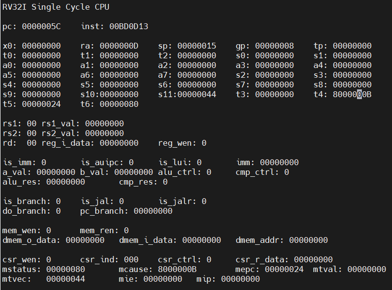

# 浙江大学实验报告
**专业：计算机科学与技术&emsp;姓名：仇国智&emsp;学号：3220102181&emsp;日期：2024/4/10 
课程名称：计算机组成与设计&emsp;实验名称:实现单周期 CPU-异常与中断&emsp; 指导老师：刘海风&emsp;成绩：**

## 操作方法与实验步骤

### 编写源文件
在4-3的基础上增加了`RV_INT`,`CSRRegs`模块.
`CSRRegs`模块:
```verilog
`include "Lab4.vh"
module CSRRegs (
    input                                   clk,
    input                                   rst,
    input      [                      11:0] raddr,
    input      [                      11:0] waddr,
    input      [                      31:0] wdata,
    input                                   csr_w,
    input      [`CSR_CHANGE_MODE_WIDTH-1:0] csr_wsc_mode,
    input      [                      31:0] mepc_bypasss_in,
    input      [                      31:0] mcause_bypass_in,
    input      [                      31:0] mtval_bypass_in,
    input      [                      31:0] mstatus_bypass_in,
    output     [                      31:0] rdata,
    output reg [                      31:0] mepc,
    output reg [                      31:0] mcause,
    output reg [                      31:0] mtval,
    output reg [                      31:0] mtvec,
    output reg [                      31:0] mstatus
);
  always @(posedge clk or posedge rst) begin
    if (rst) begin
      mepc <= 32'h0;
      mcause <= 32'h0;
      mtval <= 32'h0;
      mtvec <= 32'h44;
      mstatus <= 32'h8;
    end else if (csr_w) begin
      case (csr_wsc_mode)
        `CSR_WRITE:
        case (waddr)
          `MEPC: mepc <= wdata;
          `MCAUSE: mcause <= wdata;
          `MTVAL: mtval <= wdata;
          `MTVEC: mtvec <= wdata;
          `MSTATUS: mstatus <= wdata;
        endcase
        `CSR_OR:
        case (waddr)
          `MEPC: mepc <= mepc | wdata;
          `MCAUSE: mcause <= mcause | wdata;
          `MTVAL: mtval <= mtval | wdata;
          `MTVEC: mtvec <= mtvec | wdata;
          `MSTATUS: mstatus <= mstatus | wdata;
        endcase
        `CSR_CLEAR:
        case (waddr)
          `MEPC: mepc <= mepc & !wdata;
          `MCAUSE: mcause <= mcause & !wdata;
          `MTVAL: mtval <= mtval & !wdata;
          `MTVEC: mtvec <= mtvec & !wdata;
          `MSTATUS: mstatus <= mstatus & !wdata;
        endcase
        `CSR_BYPASS:
        begin
            mepc <= mepc_bypasss_in;
            mcause <= mcause_bypass_in;
            mtval <= mtval_bypass_in;
            mstatus <= mstatus_bypass_in;
        end
      endcase
    end
  end
assign rdata = (raddr == `MEPC) ? mepc :
              (raddr == `MCAUSE) ? mcause :
              (raddr == `MTVAL) ? mtval :
              (raddr == `MTVEC) ? mtvec :
              (raddr == `MSTATUS) ? mstatus :
              32'h0;
endmodule
```
该模块用于储存CSR寄存器的值,并且可以通过`csr_wsc_mode`来选择写入模式.`csr_wsc_mode`的值有`CSR_WRITE`,`CSR_OR`,`CSR_CLEAR`,`CSR_BYPASS`四种,分别对应写入,设定,清除,和批量写入模式.批量写入时,会将`mepc_bypasss_in`,`mcause_bypass_in`,`mtval_bypass_in`,`mstatus_bypass_in`的值写入到对应的寄存器中.
`RV_INT`模块:
```verilog
`include "Lab4.vh"
module RV_INT (
    input clk,
    input rst,
    input INT,  // 外部中断信号
    input ecall,  // ECALL 指令
    input mret,  // MRET 指令
    input illegal_inst,  // 非法指令信号
    // input l_access_fault,  // 数据访存不对齐
    // input j_access_fault,  // 跳转地址不对齐
    input [31:0] PC,  // PC
    input [11:0] raddr,
    input [11:0] waddr,
    input [31:0] wdata,
    input csr_w,
    input wire [31:0] inst_field,
    input [`CSR_CHANGE_MODE_WIDTH-1:0] csr_wsc_mode,
    output trap_normal_change,  // 用于指示trap和正常流程的转换
    output [31:0] PC_change,  // 用于指示PC流程的切换的PC
    output [31:0] rdata,  //CSR的值
    `CSR_OUTPUTS
);
  wire [31:0] mepc_bypasss_in;
  wire [31:0] mcause_bypass_in;
  wire [31:0] mtval_bypass_in;
  wire [31:0] mstatus_bypass_in;
  wire [11:0] csr_wsc_mode_real;
  wire csr_w_real;
  CSRRegs U1 (
      .clk(clk),
      .rst(rst),
      .raddr(raddr),
      .waddr(waddr),
      .wdata(wdata),
      .csr_w(csr_w_real),
      .csr_wsc_mode(csr_wsc_mode_real),
      .mepc_bypasss_in(mepc_bypasss_in),
      .mcause_bypass_in(mcause_bypass_in),
      .mtval_bypass_in(mtval_bypass_in),
      .mstatus_bypass_in(mstatus_bypass_in),
      .rdata(rdata),
      .mepc(mepc),
      .mcause(mcause),
      .mtval(mtval),
      .mtvec(mtvec),
      .mstatus(mstatus)
  );
  wire trap_start=mstatus[`MSTATUS_MIE]&&(INT||ecall||illegal_inst);//||l_access_fault||j_access_fault);
  wire trap_exit = mret;
  assign trap_normal_change = trap_exit || trap_start;
  assign csr_wsc_mode_real = trap_start || trap_exit ? `CSR_BYPASS : csr_wsc_mode;
  assign csr_w_real = trap_start || trap_exit || csr_w;
  assign PC_change = trap_start ? {mtvec[31:2], 2'b00} : trap_exit ? mepc : PC;
  assign mepc_bypasss_in = trap_start ? PC : mepc;
  assign mcause_bypass_in = trap_start ? (INT ? `MCAUSE_INT : ecall ? `MCAUSE_ECALL :illegal_inst? `MCAUSE_ILL_INST:32'h0) : mcause;
  assign mtval_bypass_in = trap_start ? (illegal_inst ? inst_field : 32'h0) : mtval;
  assign mstatus_bypass_in = trap_start ? 
  {mstatus[31:`MSTATUS_MPIE+1], mstatus[`MSTATUS_MIE], mstatus[`MSTATUS_MPIE-1:`MSTATUS_MIE+1], 1'b0, mstatus[`MSTATUS_MIE-1:0]}:
  trap_exit?
  {mstatus[31:`MSTATUS_MPIE+1], mstatus[`MSTATUS_MPIE], mstatus[`MSTATUS_MPIE-1:`MSTATUS_MIE+1], 1'b1, mstatus[`MSTATUS_MIE-1:0]}:
  mstatus;

endmodule
```
该模块用于处理异常和中断,当`mstatus`的`MIE`位为1时,并且有中断信号,或者是`ecall`指令,或者是非法指令时,会触发异常,并且批量写入CSR寄存器的值(此时写入`mstatus`的的`MIE`位为`0`,阻止`trap`处理过程中再次触发异常),同时跳转`PC`的值到`mtvec`中的值.当`mret`指令到来时,会从`mepc`中恢复PC的值,同时批量恢复CSR寄存器的值.注意到只有当中断发生和结束时,才会批量写入CSR寄存器的值同时跳转PC的值,而在其他情况下,只会按地址读取修改CSR寄存器的值.故需要`trap_normal_change`来指示非平凡状态,其余`trap`指令的执行与正常流程一致.
### 编写异常处理软件
```assembly
00100093 addi x1,x0,1
00100113 addi x2,x0,1
001101B3 add x3,x2,x1
003100B3 add x1,x2,x3
00308133 add x2,x1,x3
001101B3 add x3,x2,x1
00000073 ecall
003100B3 add x1,x2,x3
00308133 add x2,x1,x3
001101B3 add x3,x2,x1
#INT
003100B3 add x1,x2,x3
00308133 add x2,x1,x3
001101B3 add x3,x2,x1
FFFFFFFF add x0,x0,x0 #ill inst
003100B3 add x1,x2,x3
00308133 add x2,x1,x3
001101B3 add x3,x2,x1
30002FF3 csrrs x31,0x300,x0 # MSTATUS
34102F73 csrrs x30,0x341,x0 # MEPC
34202EF3 csrrs x29,0x342,x0 # MCAUSE
34302E73 csrrs x28,0x343,x0 # MTVAL
30502DF3 csrrs x27,0x305,x0 # MTVEC
80000D37 li x26,0x8000000b
00BD0D13 li x26,0x8000000b
01DD0463 beq x26,x29,else
004F0F13 addi x30,x30,4 #MEPC=MEPC+4
341F1073 else: csrrw x0,0x341,x30 # MEPC=MEPC
30505073 cssrwi 0x,0x305,0
305D9073 csrrw x0,0x305,x27
342FD073 csrrsi x0,0x342,-1
342FF073 csrrci x0,0x342,-1
343F3D73 csrrc x26,0x343,x30
30200073 mret
```
这里要注意通过读出的`mcause`的值来判断异常的类型,以确定`mepc`是否需要加4.
### 编写仿真激励文件
此时已经将软件代码写入到了`ROM`中,下面为仿真激励模块:
```verilog
`include "../sources_1/new/Lab4.vh"
module exception_tb ();
    `CSR_DECLARATION;
    reg clk = 1'b0;
    reg rst;
    wire [31:0] inst_in;
    reg [31:0] Data_in;
    reg INT;
    wire MemRW;
    wire [31:0] PC_out;
    wire [31:0] Data_out;
    wire [31:0] Addr_out;
    wire [3:0] wea;
    wire [`CSR_CHANGE_MODE_WIDTH-1:0] csr_wsc_mode;
    wire CPU_MIO;
    wire trap_normal_change;
    wire mret;
    wire ecall;
    wire [31:0]`YOUR_REGS[31:0];
    `RegFile_Regs_Declaration
    SCPU uut (
         .clk(clk),
         .rst(rst),
         .MIO_ready(MIO_ready),
         .inst_in(inst_in),
         .Data_in(Data_in),
         .INT(INT),
         .CPU_MIO(CPU_MIO),
         .MemRW(MemRW),
         .PC_out(PC_out),
         .Data_out(Data_out),
         .Addr_out(Addr_out),
         .wea(wea),
         .csr_wsc_mode(csr_wsc_mode),
         .trap_normal_change(trap_normal_change),
            .mret(mret),
            .ecall(ecall),
        `RegFile_Regs_Arguments
        `CSR_ARGUMENTS
    );
    `RegFile_Regs_Assignments
    U2 U2 (
      .a  (PC_out[11:2]),
      .spo(inst_in)
  );
always begin
    #5 clk = ~clk;
end
initial begin
    rst = 0;
    INT=0;
    Data_in=32'h00000000;
    #10;
    rst = 1;
    #10;
    rst = 0;
    #270;
    INT=1;
    #20;
    INT=0;
end
endmodule
```
下面为仿真激励图像及其分析:
`ecall`指令触发异常:

`trap`的进入和退出实现了了`PC`+4.在开始时,`ecall`信号处于高位,对应的异常代码`8000000b`存入`mcause`中,并且`mstatus`的`MIE`位被清除,阻止再次触发异常.同时`mepc`被写入`PC`的值,跳转到`mtvec`中指向的值.在期间实现了`PC`+4.在结束时,`mepc`的值被写入`PC`的值,并且`mstatus`的`MIE`位被恢复,允许再次触发异常.
`INT`信号触发异常:

分析同上,但是注意此时`PC`未进行递增,同时`INT`亮起超过一个周期,期间未发生二次`trap`.
非法指令触发异常:

分析同上,但注意此时`mtval`中存入了非法指令的值`FFFFFFFF`.
CSR寄存器的读写:

`csrrs`执行使得`x27`的值为`0x00000044`,同时`mtval`与0相与不发生改变,`csrrw`执行使得`x30`的值为`x30`寄存器的值`0x00000038`,
`cssrwi`执行使得`mtvec`的值为0,`csrrw`执行使得`mtvec`的值为`x27`的值`0x00000044`,`csrrsi`执行使得`mcause`的值为`0x0000001F`(即`0x00000002`与`0x0000001F`取或),`csrrci`执行使得`mcause`的值为`0x00000000`(即`0x0000001F`与`0xFFFFFFD0`取与),`csrrc`执行使得`mtval`的值为`0xFFFFFFFF`与`x30`的`0x00000038`取反后的值取与得`0xFFFFFFC7`.
### 其余修改模块
下面是其它一些修改过的模块
`Lab4.vh`
```verilog
/* WHAT'S THIS HEADERFILE FOR? */
/*
 * Reffered to code written by PanZiyue, TA of 2020_CO 
 * Macro for opcode/func3 for RV32I
 * declaration, inputs/outputs, assignment for debug signals(RegFile)
*/
// CSR ouput
`define CSR_OUTPUTS \
      output wire [31:0] mepc,\
      output wire [31:0] mcause,\
      output wire [31:0] mtval,\
      output wire [31:0] mtvec,\
      output wire [31:0] mstatus
// CSR ARGUMENTS
`define CSR_ARGUMENTS \
      .mepc(mepc),\
      .mcause(mcause),\
      .mtval(mtval),\
      .mtvec(mtvec),\
      .mstatus(mstatus)
// CSR DECLARATION
`define CSR_DECLARATION \
      wire [31:0] mepc;\
      wire [31:0] mcause;\
      wire [31:0] mtval;\
      wire [31:0] mtvec;\
      wire [31:0] mstatus
//direct inst
`define ECALL 15'b0000000_000_11100
`define MRET 15'b0011000_000_11100
/*MCAUSE*/
`define MCAUSE_ECALL 32'h8000_0003
`define MCAUSE_INT 32'h8000_000b
`define MCAUSE_ILL_INST 32'h0000_0002
/*MASTATUS*/
`define MSTATUS_MIE 5'd3
`define MSTATUS_MPIE 5'd7
/*CSR*/
`define MSTATUS 12'h300
`define MEPC 12'h341
`define MCAUSE 12'h342
`define MTVAL 12'h343
`define MTVEC 12'h305

/*CSR change mode*/
`define CSR_CHANGE_MODE_WIDTH 2
`define CSR_WRITE 2'b00
`define CSR_OR 2'b01
`define CSR_CLEAR 2'b10
`define CSR_BYPASS 2'b11
/* wea */
`define WEA_READ 4'b0000
`define WEA_BYTE 4'b0001
`define WEA_HALF 4'b0011
`define WEA_WORD 4'b1111
/*JUMP CHOOSE*/
`define JUMP_PC_IMM 1'b0
`define JUMP_ALU 1'b1
/* Byte/Half/Word */
`define BYTE 2'b00
`define HALF 2'b01
`define WORD 2'b10
/* ALU Operation(Using in Lab1) */
`define ALU_OP_WIDTH 4

`define ALU_OP_ADD `ALU_OP_WIDTH'd0
`define ALU_OP_SUB `ALU_OP_WIDTH'd1
`define ALU_OP_SLL `ALU_OP_WIDTH'd2
`define ALU_OP_SLT `ALU_OP_WIDTH'd3
`define ALU_OP_SLTU `ALU_OP_WIDTH'd4
`define ALU_OP_XOR `ALU_OP_WIDTH'd5
`define ALU_OP_SRL `ALU_OP_WIDTH'd6
`define ALU_OP_SRA `ALU_OP_WIDTH'd7
`define ALU_OP_OR `ALU_OP_WIDTH'd8
`define ALU_OP_AND `ALU_OP_WIDTH'd9
`define ALU_OP_EQ `ALU_OP_WIDTH'd10
`define ALU_OP_SGE `ALU_OP_WIDTH'd11
`define ALU_OP_SGEU `ALU_OP_WIDTH'd12
`define ALU_OP_R2 `ALU_OP_WIDTH'd13
`define ALU_OP_R1 `ALU_OP_WIDTH'd14

/*-----------------------------------*/

/* Inst decoding(Using in Lab4/5) */
/* Opcode(5-bits) */
// R-Type
`define OPCODE_ALU 5'b01100
// I-Type
`define OPCODE_ALU_IMM 5'b00100
`define OPCODE_LOAD 5'b00000
`define OPCODE_JALR 5'b11001
`define OPCODE_ENV 5'b11100
`define OPCODE_JALR 5'b11001
// S-Type
`define OPCODE_STORE 5'b01000
// B-Type
`define OPCODE_BRANCH 5'b11000
// J-Type
`define OPCODE_JAL 5'b11011
// U-Type
`define OPCODE_LUI 5'b01101
`define OPCODE_AUIPC 5'b00101

`define OPCODE_CSR 5'b11100
// not use
`define OPCODE_PASS 5'b00000

/* Func3(3-bits) */
// R-Type & I-Type(ALU)
// For R-Type, SUB if inst[30] else ADD
`define FUNC_ADD 3'd0
// Shift Left (Logical)
`define FUNC_SL 3'd1
`define FUNC_SLT 3'd2
`define FUNC_SLTU 3'd3
`define FUNC_XOR 3'd4
// Shift Right Arith if inst[30] else Logical
`define FUNC_SR 3'd5
`define FUNC_OR 3'd6
`define FUNC_AND 3'd7

// I-Type(Load) & S-Type
`define FUNC_BYTE 3'd0
`define FUNC_HALF 3'd1
`define FUNC_WORD 3'd2
`define FUNC_BYTE_UNSIGNED 3'd4
`define FUNC_HALF_UNSIGNED 3'd5

// B-Type
`define FUNC_EQ 3'd0
`define FUNC_NE 3'd1
`define FUNC_LT 3'd4
`define FUNC_GE 3'd5
`define FUNC_LTU 3'd6
`define FUNC_GEU 3'd7
/*-----------------------------------*/

// CSR FUNC
`define FUNC_CSRRW 3'd1
`define FUNC_CSRRS 3'd2
`define FUNC_CSRRC 3'd3
`define FUNC_CSRRWI 3'd5
`define FUNC_CSRRSI 3'd6
`define FUNC_CSRRCI 3'd7

// JAR
`define FUNC_JALR 3'd0
/* ImmSel signals */
// NOTE: You may add terms in Lab4-3 to implement more inst.
`define IMM_SEL_WIDTH 3

`define IMM_SEL_I `IMM_SEL_WIDTH'd0
`define IMM_SEL_S `IMM_SEL_WIDTH'd1
`define IMM_SEL_B `IMM_SEL_WIDTH'd2
`define IMM_SEL_J `IMM_SEL_WIDTH'd3
`define IMM_SEL_U `IMM_SEL_WIDTH'd4
`define IMM_SEL_CSR `IMM_SEL_WIDTH'd6
/*-----------------------------------*/

/* Mem2Reg signals */
// NOTE: You may add terms in Lab4-3 to implement more inst.
`define MEM2REG_WIDTH 3

`define MEM2REG_ALU `MEM2REG_WIDTH'd0
`define MEM2REG_MEM `MEM2REG_WIDTH'd1
`define MEM2REG_PC_PLUS `MEM2REG_WIDTH'd2
`define MEM2REG_IMM_PC `MEM2REG_WIDTH'd3
`define MEM2REG_CSR `MEM2REG_WIDTH'd4
// `define MEM2REG_IMM         `MEM2REG_WIDTH'd4
/*-----------------------------------*/

/*----------------------------*/
/******* generated code *******/
/*----------------------------*/

/* RegFiles Ports & debug signals */
/* NOTE:
 * AFTER you change "..." in macro YOUR_REGS to the name of your reg-array in module Regs, such as regs,
 * you need to *uncomment* the line "`define YOUR_REGS regs" below for using this set of macros
*/
// `define YOUR_REGS ...
`define YOUR_REGS MY_REGS
`ifdef YOUR_REGS

`define RegFile_Regs_Outputs \
    output [31:0] Reg00, \
    output [31:0] Reg01, \
    output [31:0] Reg02, \
    output [31:0] Reg03, \
    output [31:0] Reg04, \
    output [31:0] Reg05, \
    output [31:0] Reg06, \
    output [31:0] Reg07, \
    output [31:0] Reg08, \
    output [31:0] Reg09, \
    output [31:0] Reg10, \
    output [31:0] Reg11, \
    output [31:0] Reg12, \
    output [31:0] Reg13, \
    output [31:0] Reg14, \
    output [31:0] Reg15, \
    output [31:0] Reg16, \
    output [31:0] Reg17, \
    output [31:0] Reg18, \
    output [31:0] Reg19, \
    output [31:0] Reg20, \
    output [31:0] Reg21, \
    output [31:0] Reg22, \
    output [31:0] Reg23, \
    output [31:0] Reg24, \
    output [31:0] Reg25, \
    output [31:0] Reg26, \
    output [31:0] Reg27, \
    output [31:0] Reg28, \
    output [31:0] Reg29, \
    output [31:0] Reg30, \
    output [31:0] Reg31,

`define RegFile_Regs_Assignments \
    assign Reg00 = `YOUR_REGS[0]; \
    assign Reg01 = `YOUR_REGS[1]; \
    assign Reg02 = `YOUR_REGS[2]; \
    assign Reg03 = `YOUR_REGS[3]; \
    assign Reg04 = `YOUR_REGS[4]; \
    assign Reg05 = `YOUR_REGS[5]; \
    assign Reg06 = `YOUR_REGS[6]; \
    assign Reg07 = `YOUR_REGS[7]; \
    assign Reg08 = `YOUR_REGS[8]; \
    assign Reg09 = `YOUR_REGS[9]; \
    assign Reg10 = `YOUR_REGS[10]; \
    assign Reg11 = `YOUR_REGS[11]; \
    assign Reg12 = `YOUR_REGS[12]; \
    assign Reg13 = `YOUR_REGS[13]; \
    assign Reg14 = `YOUR_REGS[14]; \
    assign Reg15 = `YOUR_REGS[15]; \
    assign Reg16 = `YOUR_REGS[16]; \
    assign Reg17 = `YOUR_REGS[17]; \
    assign Reg18 = `YOUR_REGS[18]; \
    assign Reg19 = `YOUR_REGS[19]; \
    assign Reg20 = `YOUR_REGS[20]; \
    assign Reg21 = `YOUR_REGS[21]; \
    assign Reg22 = `YOUR_REGS[22]; \
    assign Reg23 = `YOUR_REGS[23]; \
    assign Reg24 = `YOUR_REGS[24]; \
    assign Reg25 = `YOUR_REGS[25]; \
    assign Reg26 = `YOUR_REGS[26]; \
    assign Reg27 = `YOUR_REGS[27]; \
    assign Reg28 = `YOUR_REGS[28]; \
    assign Reg29 = `YOUR_REGS[29]; \
    assign Reg30 = `YOUR_REGS[30]; \
    assign Reg31 = `YOUR_REGS[31];

`define RegFile_Regs_Arguments \
    .Reg00(Reg00), \
    .Reg01(Reg01), \
    .Reg02(Reg02), \
    .Reg03(Reg03), \
    .Reg04(Reg04), \
    .Reg05(Reg05), \
    .Reg06(Reg06), \
    .Reg07(Reg07), \
    .Reg08(Reg08), \
    .Reg09(Reg09), \
    .Reg10(Reg10), \
    .Reg11(Reg11), \
    .Reg12(Reg12), \
    .Reg13(Reg13), \
    .Reg14(Reg14), \
    .Reg15(Reg15), \
    .Reg16(Reg16), \
    .Reg17(Reg17), \
    .Reg18(Reg18), \
    .Reg19(Reg19), \
    .Reg20(Reg20), \
    .Reg21(Reg21), \
    .Reg22(Reg22), \
    .Reg23(Reg23), \
    .Reg24(Reg24), \
    .Reg25(Reg25), \
    .Reg26(Reg26), \
    .Reg27(Reg27), \
    .Reg28(Reg28), \
    .Reg29(Reg29), \
    .Reg30(Reg30), \
    .Reg31(Reg31),

`define RegFile_Regs_Declaration \
    wire [31:0] Reg00; \
    wire [31:0] Reg01; \
    wire [31:0] Reg02; \
    wire [31:0] Reg03; \
    wire [31:0] Reg04; \
    wire [31:0] Reg05; \
    wire [31:0] Reg06; \
    wire [31:0] Reg07; \
    wire [31:0] Reg08; \
    wire [31:0] Reg09; \
    wire [31:0] Reg10; \
    wire [31:0] Reg11; \
    wire [31:0] Reg12; \
    wire [31:0] Reg13; \
    wire [31:0] Reg14; \
    wire [31:0] Reg15; \
    wire [31:0] Reg16; \
    wire [31:0] Reg17; \
    wire [31:0] Reg18; \
    wire [31:0] Reg19; \
    wire [31:0] Reg20; \
    wire [31:0] Reg21; \
    wire [31:0] Reg22; \
    wire [31:0] Reg23; \
    wire [31:0] Reg24; \
    wire [31:0] Reg25; \
    wire [31:0] Reg26; \
    wire [31:0] Reg27; \
    wire [31:0] Reg28; \
    wire [31:0] Reg29; \
    wire [31:0] Reg30; \
    wire [31:0] Reg31;

`define VGA_RegFile_Inputs \
    input [31:0] Reg00, \
    input [31:0] Reg01, \
    input [31:0] Reg02, \
    input [31:0] Reg03, \
    input [31:0] Reg04, \
    input [31:0] Reg05, \
    input [31:0] Reg06, \
    input [31:0] Reg07, \
    input [31:0] Reg08, \
    input [31:0] Reg09, \
    input [31:0] Reg10, \
    input [31:0] Reg11, \
    input [31:0] Reg12, \
    input [31:0] Reg13, \
    input [31:0] Reg14, \
    input [31:0] Reg15, \
    input [31:0] Reg16, \
    input [31:0] Reg17, \
    input [31:0] Reg18, \
    input [31:0] Reg19, \
    input [31:0] Reg20, \
    input [31:0] Reg21, \
    input [31:0] Reg22, \
    input [31:0] Reg23, \
    input [31:0] Reg24, \
    input [31:0] Reg25, \
    input [31:0] Reg26, \
    input [31:0] Reg27, \
    input [31:0] Reg28, \
    input [31:0] Reg29, \
    input [31:0] Reg30, \
    input [31:0] Reg31,

`define VGA_RegFile_Arguments \
    .x0 (Reg00), \
    .ra (Reg01), \
    .sp (Reg02), \
    .gp (Reg03), \
    .tp (Reg04), \
    .t0 (Reg05), \
    .t1 (Reg06), \
    .t2 (Reg07), \
    .s0 (Reg08), \
    .s1 (Reg09), \
    .a0 (Reg10), \
    .a1 (Reg11), \
    .a2 (Reg12), \
    .a3 (Reg13), \
    .a4 (Reg14), \
    .a5 (Reg15), \
    .a6 (Reg16), \
    .a7 (Reg17), \
    .s2 (Reg18), \
    .s3 (Reg19), \
    .s4 (Reg20), \
    .s5 (Reg21), \
    .s6 (Reg22), \
    .s7 (Reg23), \
    .s8 (Reg24), \
    .s9 (Reg25), \
    .s10(Reg26), \
    .s11(Reg27), \
    .t3 (Reg28), \
    .t4 (Reg29), \
    .t5 (Reg30), \
    .t6 (Reg31),

`endif  // YOUR_REGS

`define VGA_Debug_Signals_Inputs \
    input [31:0] pc, \
    input [31:0] inst, \
    input [4:0] rs1, \
    input [31:0] rs1_val, \
    input [4:0] rs2, \
    input [31:0] rs2_val, \
    input [4:0] rd, \
    input [31:0] reg_i_data, \
    input reg_wen, \
    input is_imm, \
    input is_auipc, \
    input is_lui, \
    input [31:0] imm, \
    input [31:0] a_val, \
    input [31:0] b_val, \
    input [3:0] alu_ctrl, \
    input [2:0] cmp_ctrl, \
    input [31:0] alu_res, \
    input cmp_res, \
    input is_branch, \
    input is_jal, \
    input is_jalr, \
    input do_branch, \
    input [31:0] pc_branch, \
    input mem_wen, \
    input mem_ren, \
    input [31:0] dmem_o_data, \
    input [31:0] dmem_i_data, \
    input [31:0] dmem_addr,

`define VGA_Debug_Signals_Arguments \
    .pc(pc), \
    .inst(inst), \
    .rs1(rs1), \
    .rs1_val(rs1_val), \
    .rs2(rs2), \
    .rs2_val(rs2_val), \
    .rd(rd), \
    .reg_i_data(reg_i_data), \
    .reg_wen(reg_wen), \
    .is_imm(is_imm), \
    .is_auipc(is_auipc), \
    .is_lui(is_lui), \
    .imm(imm), \
    .a_val(a_val), \
    .b_val(b_val), \
    .alu_ctrl(alu_ctrl), \
    .cmp_ctrl(cmp_ctrl), \
    .alu_res(alu_res), \
    .cmp_res(cmp_res), \
    .is_branch(is_branch), \
    .is_jal(is_jal), \
    .is_jalr(is_jalr), \
    .do_branch(do_branch), \
    .pc_branch(pc_branch), \
    .mem_wen(mem_wen), \
    .mem_ren(mem_ren), \
    .dmem_o_data(dmem_o_data), \
    .dmem_i_data(dmem_i_data), \
    .dmem_addr(dmem_addr),

`define VGA_Debug_Signals_Outputs \
    output [31:0] pc, \
    output [31:0] inst, \
    output [4:0] rs1, \
    output [31:0] rs1_val, \
    output [4:0] rs2, \
    output [31:0] rs2_val, \
    output [4:0] rd, \
    output [31:0] reg_i_data, \
    output reg_wen, \
    output is_imm, \
    output is_auipc, \
    output is_lui, \
    output [31:0] imm, \
    output [31:0] a_val, \
    output [31:0] b_val, \
    output [3:0] alu_ctrl, \
    output [2:0] cmp_ctrl, \
    output [31:0] alu_res, \
    output cmp_res, \
    output is_branch, \
    output is_jal, \
    output is_jalr, \
    output do_branch, \
    output [31:0] pc_branch, \
    output mem_wen, \
    output mem_ren, \
    output [31:0] dmem_o_data, \
    output [31:0] dmem_i_data, \
    output [31:0] dmem_addr,
```
`ALU`模块:
```verilog
`timescale 1ns / 1ps
module ALU (
    input  [31:0] A,
    input  [31:0] B,
    input  [ 3:0] ALU_operation,
    output [31:0] res,
    output        zero
);
  wire signed [31:0] A_s = $signed(A);
  wire signed [31:0] B_s = $signed(B);
  wire [31:0] A_u = $unsigned(A);
  wire [31:0] B_u = $unsigned(B);
  wire [31:0] result0 = A_s + B_s;
  wire [31:0] result1 = A_s - B_s;
  wire [31:0] result2 = A << B[4:0];
  wire [31:0] result3 = (A_s < B_s) ? 32'b1 : 32'b0;
  wire [31:0] result4 = (A_u < B_u) ? 32'b1 : 32'b0;
  wire [31:0] result5 = A ^ B;
  wire [31:0] result6 = A >> B[4:0];
  wire [31:0] result7 = A_s >>> B_s[4:0];
  wire [31:0] result8 = A | B;
  wire [31:0] result9 = A & B;
  wire [31:0] result10 = ~|result1;
  wire [31:0] result11 = ~|result3;
  wire [31:0] result12 = ~|result4;
  wire [31:0] result13 = B;
  wire [31:0] result14 = A;
  assign res = (ALU_operation==4'b0000)?result0:
                (ALU_operation==4'b0001)?result1:
                (ALU_operation==4'b0010)?result2:
                (ALU_operation==4'b0011)?result3:
                (ALU_operation==4'b0100)?result4:
                (ALU_operation==4'b0101)?result5:
                (ALU_operation==4'b0110)?result6:
                (ALU_operation==4'b0111)?result7:
                (ALU_operation==4'b1000)?result8:
                (ALU_operation==4'b1001)?result9:
                (ALU_operation==4'b1010)?result10:
                (ALU_operation==4'b1011)?result11:
                (ALU_operation==4'b1100)?result12:
                (ALU_operation==4'b1101)?result13:
                (ALU_operation==4'b1110)?result14:
                32'b0;
  assign zero = ~(|res) ? 1'b1 : 1'b0;
endmodule
```
`Controler`模块
```verilog
// RISC-V Controler
`include "Lab4.vh"
module Controler (
    input wire [4:0] OPcode,
    input wire MIO_ready,
    input wire [6:0] Fun7,
    input wire [2:0] Fun3,
    output reg CPU_MIO,
    output reg [3:0] wea,
    output reg [`IMM_SEL_WIDTH-1:0] ImmSell,
    output reg [`MEM2REG_WIDTH-1:0] MemtoReg,
    output reg [`ALU_OP_WIDTH-1:0] ALU_Control,
    output reg ALUSrc_B,
    output reg Jump,
    output reg Branch,
    output reg RegWrite,
    output reg sign,
    output reg [1:0] byte_n,
    output reg jump_choose,
    output reg illegal_inst,
    output reg csr_w,
    output reg [`CSR_CHANGE_MODE_WIDTH-1:0] csr_wsc_mode,
    output ecall,
    output mret
);
  assign ecall = {Fun7,Fun3,OPcode} == `ECALL;
  assign mret = {Fun7,Fun3,OPcode} == `MRET;
  always @(*) begin
    case (OPcode)
      `OPCODE_ALU: begin
        CPU_MIO <= 1'b0;
        wea <= `WEA_READ;
        ImmSell <= 3'b0;
        MemtoReg <= `MEM2REG_ALU;
        case (Fun3)
          `FUNC_ADD: ALU_Control <= Fun7[5] ? `ALU_OP_SUB : `ALU_OP_ADD;
          `FUNC_SL: ALU_Control <= `ALU_OP_SLL;
          `FUNC_SLT: ALU_Control <= `ALU_OP_SLT;
          `FUNC_SLTU: ALU_Control <= `ALU_OP_SLTU;
          `FUNC_XOR: ALU_Control <= `ALU_OP_XOR;
          `FUNC_OR: ALU_Control <= `ALU_OP_OR;
          `FUNC_AND: ALU_Control <= `ALU_OP_AND;
          `FUNC_SR: ALU_Control <= Fun7[5] ? `ALU_OP_SRA : `ALU_OP_SRL;
          default: ALU_Control <= 4'b0;
        endcase
        ALUSrc_B <= 1'b0;
        Jump <= 1'b0;
        Branch <= 1'b0;
        RegWrite <= 1'b1;
        sign <= 1'b0;
        byte_n <= `WORD;
        jump_choose <= `JUMP_PC_IMM;
        illegal_inst <= 1'b0;
        csr_w <= 1'b0;
        csr_wsc_mode <= `CSR_WRITE;
      end
      `OPCODE_ALU_IMM: begin
        CPU_MIO <= 1'b0;
        wea <= `WEA_READ;
        ImmSell <= `IMM_SEL_I;
        MemtoReg <= `MEM2REG_ALU;
        case (Fun3)
          `FUNC_ADD: ALU_Control <= `ALU_OP_ADD;
          `FUNC_SL: ALU_Control <= `ALU_OP_SLL;
          `FUNC_SLT: ALU_Control <= `ALU_OP_SLT;
          `FUNC_SLTU: ALU_Control <= `ALU_OP_SLTU;
          `FUNC_XOR: ALU_Control <= `ALU_OP_XOR;
          `FUNC_OR: ALU_Control <= `ALU_OP_OR;
          `FUNC_AND: ALU_Control <= `ALU_OP_AND;
          `FUNC_SR: ALU_Control <= Fun7[5] ? `ALU_OP_SRA : `ALU_OP_SRL;
          default: ALU_Control <= 4'b0;
        endcase
        ALUSrc_B <= 1'b1;
        Jump <= 1'b0;
        Branch <= 1'b0;
        RegWrite <= 1'b1;
        sign <= 1'b1;
        byte_n <= `WORD;
        jump_choose <= `JUMP_PC_IMM;
        illegal_inst <= 1'b0;
        csr_w <= 1'b0;
        csr_wsc_mode <= `CSR_WRITE;
      end
      `OPCODE_LOAD: begin
        CPU_MIO <= 1'b1;
        wea <= `WEA_READ;
        ImmSell <= `IMM_SEL_I;
        MemtoReg <= `MEM2REG_MEM;
        ALU_Control <= 4'b0;
        ALUSrc_B <= 1'b1;
        Jump <= 1'b0;
        Branch <= 1'b0;
        RegWrite <= 1'b1;
        sign <= ~(Fun3 == `FUNC_BYTE_UNSIGNED || Fun3 == `FUNC_HALF_UNSIGNED);
        case (Fun3)
          `FUNC_BYTE, `FUNC_BYTE_UNSIGNED: byte_n <= `BYTE;
          `FUNC_HALF, `FUNC_HALF_UNSIGNED: byte_n <= `HALF;
          `FUNC_WORD: byte_n <= `WORD;
          default: byte_n <= `WORD;
        endcase
        jump_choose <= `JUMP_PC_IMM;
        illegal_inst <= 1'b0;
        csr_w <= 1'b0;
        csr_wsc_mode <= `CSR_WRITE;
      end
      `OPCODE_STORE: begin
        CPU_MIO <= 1'b1;
        case (Fun3)
          `FUNC_BYTE: wea <= `WEA_BYTE;
          `FUNC_HALF: wea <= `WEA_HALF;
          `FUNC_WORD: wea <= `WEA_WORD;
          default: wea <= `WEA_READ;
        endcase
        ImmSell <= `IMM_SEL_S;
        MemtoReg <= `MEM2REG_MEM;
        ALU_Control <= 4'b0;
        ALUSrc_B <= 1'b1;
        Jump <= 1'b0;
        Branch <= 1'b0;
        RegWrite <= 1'b0;
        sign <= 1'b1;
        byte_n <= `WORD;
        jump_choose <= `JUMP_PC_IMM;
        illegal_inst <= 1'b0;
        csr_w <= 1'b0;
        csr_wsc_mode <= `CSR_WRITE;
      end
      `OPCODE_BRANCH: begin
        CPU_MIO <= 1'b0;
        wea <= `WEA_READ;
        ImmSell <= `IMM_SEL_B;
        MemtoReg <= `MEM2REG_ALU;
        case (Fun3)
          `FUNC_EQ:  ALU_Control <= `ALU_OP_SUB;
          `FUNC_NE:  ALU_Control <= `ALU_OP_EQ;
          `FUNC_LT:  ALU_Control <= `ALU_OP_SGE;
          `FUNC_GE:  ALU_Control <= `ALU_OP_SLT;
          `FUNC_LTU: ALU_Control <= `ALU_OP_SGEU;
          `FUNC_GEU: ALU_Control <= `ALU_OP_SLTU;
          default:   ALU_Control <= 4'b0;
        endcase
        ALUSrc_B <= 1'b0;
        Jump <= 1'b0;
        Branch <= 1'b1;
        RegWrite <= 1'b0;
        sign <= 1'b1;
        byte_n <= `WORD;
        jump_choose <= `JUMP_PC_IMM;
        illegal_inst <= 1'b0;
        csr_w <= 1'b0;
        csr_wsc_mode <= `CSR_WRITE;
      end
      `OPCODE_JAL: begin
        CPU_MIO <= 1'b0;
        wea <= `WEA_READ;
        ImmSell <= `IMM_SEL_J;
        jump_choose <= `JUMP_PC_IMM;
        MemtoReg <= `MEM2REG_PC_PLUS;
        ALU_Control <= `ALU_OP_ADD;
        ALUSrc_B <= 1'b1;
        Jump <= 1'b1;
        Branch <= 1'b0;
        RegWrite <= 1'b1;
        sign <= 1'b1;
        byte_n <= `WORD;
        illegal_inst <= 1'b0;
        csr_w <= 1'b0;
        csr_wsc_mode <= `CSR_WRITE;
      end
      `OPCODE_JALR: begin
        CPU_MIO <= 1'b0;
        wea <= `WEA_READ;
        ImmSell <= `IMM_SEL_I;
        MemtoReg <= `MEM2REG_PC_PLUS;
        ALU_Control <= `ALU_OP_ADD;
        ALUSrc_B <= 1'b1;
        Jump <= 1'b1;
        Branch <= 1'b0;
        RegWrite <= 1'b1;
        sign <= 1'b1;
        byte_n <= `WORD;
        jump_choose <= `JUMP_ALU;
        illegal_inst <= 1'b0;
        csr_w <= 1'b0;
        csr_wsc_mode <= `CSR_WRITE;
      end
      `OPCODE_LUI: begin
        CPU_MIO <= 1'b0;
        wea <= `WEA_READ;
        ImmSell <= `IMM_SEL_U;
        MemtoReg <= `MEM2REG_ALU;
        ALU_Control <= `ALU_OP_R2;
        ALUSrc_B <= 1'b1;
        Jump <= 1'b0;
        Branch <= 1'b0;
        RegWrite <= 1'b1;
        sign <= 1'b1;
        byte_n <= `WORD;
        jump_choose <= `JUMP_PC_IMM;
        illegal_inst <= 1'b0;
        csr_w <= 1'b0;
        csr_wsc_mode <= `CSR_WRITE;
      end
      `OPCODE_AUIPC: begin
        CPU_MIO <= 1'b0;
        wea <= `WEA_READ;
        ImmSell <= `IMM_SEL_U;
        MemtoReg <= `MEM2REG_IMM_PC;
        ALU_Control <= `ALU_OP_ADD;
        ALUSrc_B <= 1'b1;
        Jump <= 1'b0;
        Branch <= 1'b0;
        RegWrite <= 1'b1;
        sign <= 1'b1;
        byte_n <= `WORD;
        jump_choose <= `JUMP_PC_IMM;
        illegal_inst <= 1'b0;
        csr_w <= 1'b0;
        csr_wsc_mode <= `CSR_WRITE;
      end
      `OPCODE_CSR: begin
        CPU_MIO <= 1'b0;
        wea <= `WEA_READ;
        ImmSell <= `IMM_SEL_CSR;
        MemtoReg <= `MEM2REG_CSR;
        ALUSrc_B <= 1'b1;
        RegWrite <= 1'b1;
        case(Fun3)
          `FUNC_CSRRW: 
          begin
            ALU_Control <= `ALU_OP_R1;
            csr_wsc_mode <= `CSR_WRITE;
          end
          `FUNC_CSRRS:
          begin
            ALU_Control <= `ALU_OP_R1;
            csr_wsc_mode <= `CSR_OR;
          end
          `FUNC_CSRRC:
          begin
            ALU_Control <= `ALU_OP_R1;
            csr_wsc_mode <= `CSR_CLEAR;
          end
          `FUNC_CSRRWI:
          begin
            ALU_Control <= `ALU_OP_R2;
            csr_wsc_mode <= `CSR_WRITE;
          end
          `FUNC_CSRRSI:
          begin
            ALU_Control <= `ALU_OP_R2;
            csr_wsc_mode <= `CSR_OR;
          end
          `FUNC_CSRRCI:
          begin
            ALU_Control <= `ALU_OP_R2;
            csr_wsc_mode <= `CSR_CLEAR;
          end
          default:
          begin
            ALU_Control <= `ALU_OP_R1;
            csr_wsc_mode <= `CSR_BYPASS;
          end
        endcase
        Jump <= 1'b0;
        Branch <= 1'b0;
        sign <= 1'b0;
        byte_n <= `WORD;
        jump_choose <= `JUMP_PC_IMM;
        illegal_inst <= 1'b0;
        csr_w <= 1'b1;
      end
      default:
      begin
        CPU_MIO <= 1'b0;
        wea <= `WEA_READ;
        ImmSell <= 3'b0;
        MemtoReg <= `MEM2REG_CSR;
        ALU_Control <= 4'b0;
        ALUSrc_B <= 1'b0;
        Jump <= 1'b0;
        Branch <= 1'b0;
        RegWrite <= 1'b0;
        sign <= 1'b0;
        byte_n <= `WORD;
        jump_choose <= `JUMP_PC_IMM;
        illegal_inst <= 1;
        csr_w <= 1'b1;
        csr_wsc_mode <= `CSR_BYPASS;
      end

    endcase
  end
endmodule
```
`DataPath`模块
```verilog

`include "Lab4.vh"
module DataPath (
    `RegFile_Regs_Outputs
    input wire clk,
    input wire rst,
    input wire [31:0] inst_field,
    input wire [31:0] Data_in,
    input wire [`IMM_SEL_WIDTH-1:0] ImmSell,
    input wire ALUSrc_B,
    input wire [`MEM2REG_WIDTH-1:0] MemtoReg,
    input wire Jump,
    input wire Branch,
    input wire RegWrite,
    input wire [`ALU_OP_WIDTH-1:0] ALU_Control,
    input wire sign,
    input wire [1:0] byte_n,
    input wire jump_choose,
    input wire illegal_inst,
    input wire csr_w,
    input wire [`CSR_CHANGE_MODE_WIDTH-1:0] csr_wsc_mode,
    input wire ecall,
    input wire mret,
    input wire INT,
    output wire [31:0] PC_out,
    output wire [31:0] Data_out,
    output wire [31:0] Addr_out,
    output wire trap_normal_change,
    `CSR_OUTPUTS
);
  reg  [31:0] PC = 32'h4;
  wire [31:0] imm;
  ImmGen U1 (
      .ImmSell(ImmSell),
      .inst_field(inst_field),
      .sign(1'b1),
      .Imm(imm)
  );
  wire [31:0] Rs1_data, Rs2_data;
  wire [4:0] Rs1_addr, Rs2_addr, W_addr;
  wire [31:0] W_data;

  wire [31:0] ALU_out;
  wire [11:0] CSR_raddr = inst_field[31:20];
  wire [31:0] CSR_wdata = ALU_out;
  wire [31:0] CSR_waddr = inst_field[31:20];
  wire [31:0] PC_change;
  wire [31:0] CSR_rdata;

  RV_INT U5 (
      .clk(clk),
      .rst(rst),
      .INT(INT),
      .ecall(ecall),
      .mret(mret),
      .illegal_inst(illegal_inst),
      .PC(PC),
      .raddr(CSR_raddr),
      .waddr(CSR_waddr),
      .wdata(CSR_wdata),
      .csr_w(csr_w),
      .csr_wsc_mode(csr_wsc_mode),
      .trap_normal_change(trap_normal_change),
      .PC_change(PC_change),
      .rdata(CSR_rdata),
      .inst_field(inst_field),
      `CSR_ARGUMENTS
  );
  assign Rs1_addr = inst_field[19:15];
  assign Rs2_addr = inst_field[24:20];
  assign W_addr   = inst_field[11:7];
  Regs U2 (
      `RegFile_Regs_Arguments
      .clk(clk),
      .rst(rst),
      .Rs1_addr(Rs1_addr),
      .Rs2_addr(Rs2_addr),
      .Wt_addr(W_addr),
      .Wt_data(W_data),
      .RegWrite(RegWrite & !trap_normal_change),
      .Rs1_data(Rs1_data),
      .Rs2_data(Rs2_data)
  );
  wire [31:0] adder_2;
  wire zero;
  ALU U3 (
      .A(Rs1_data),
      .B(adder_2),
      .ALU_operation(ALU_Control),
      .res(ALU_out),
      .zero(zero)
  );
  assign Addr_out = ALU_out;
  assign Data_out = Rs2_data;
  wire [31:0] mem_out;
  extend U4 (
      .byte_n(byte_n),
      .in(Data_in >> ((Addr_out % 4) << 3)),
      .sign(sign),
      .mem_data(mem_out)
  );

  assign adder_2 = ALUSrc_B ? imm : Rs2_data;

  wire [31:0] PC_add_4 = PC + 4;
  wire [31:0] PC_imm = imm + PC;
  wire Branch_final = Branch & zero;
  wire [31:0] PC_branch = Branch_final ? PC_imm : PC_add_4;
  wire [31:0] PC_jump = Jump ? ((jump_choose == `JUMP_ALU) ? ALU_out : PC_imm) : PC_branch;
  assign PC_out = trap_normal_change ? PC_change : PC_jump;

  always @(posedge clk or posedge rst) begin
    if (rst) begin
      PC <= 32'hFFFFFFFC;
    end else begin
      PC <= PC_out;
    end
  end

  assign W_data=MemtoReg==`MEM2REG_MEM?mem_out:
            MemtoReg==`MEM2REG_ALU?ALU_out:
            MemtoReg==`MEM2REG_PC_PLUS?PC_add_4:
            MemtoReg==`MEM2REG_IMM_PC?PC_imm:
            MemtoReg==`MEM2REG_CSR?CSR_rdata:32'b0;

endmodule
```
## 下板验证
注意这里的`PC`为正在执行指令的下一条指令
`ecall`指令的退出与进入:


硬件中断的进入与退出:



非法指令中断的进入与退出,注意`mtval`正确保存了非法指令的值:


## 思考题
在涉及到一个大立即数的读入时，我们经常能想到使用 lui & addi 来实现，比如下面这段代码就将 0x22223333 赋给了 t0:

lui t0, 0x22223
addi t0, t0, 0x333
你是否能通过以下代码得到 0xDEADBEEF？如果你觉得不能的话，先解释为什么不能，再修改代码中的一个字符，使得以下代码有效地得到 0xDEADBEEF。（如果你觉得可以的话，请重新学习 RISC-V ISA）

lui t1, 0xDEADB
addi t1, t1, 0xEEF
btw, 如果你把上边代码放到 Venus 上，会发现它给了你一个报错，不要理会它，它理解错了。
回答:
不行,因为立即数是有符号扩展的,`EEF`会扩展为`0xFFFFFEEF`,加上`0xDEADB000`得到`0xDEADAEEF`,当立即数实际解释为负数时,会扩展为负数造成前五位产生一个退位,故无法得到`0xDEADBEEF`.修改`0xDEADB`为`0xDEADC`即可得到`0xDEADBEEF`.