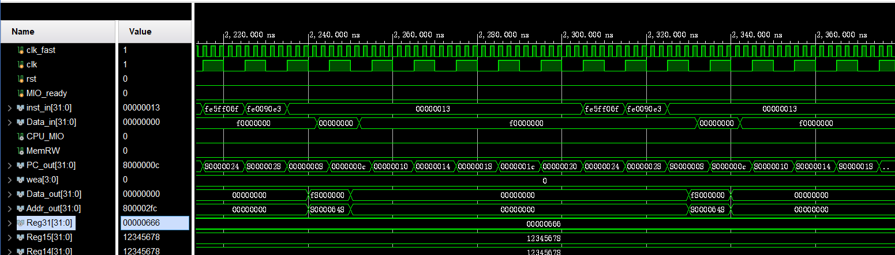

# Lab5-PCPU
## Datapath

详细的接口如下

<embed id="pdfPlayer" src="D:\courses\23_2\CO\lab5\assets\schematic.pdf" type="application/pdf" width="100%" height="600" >

## CPU源码设计
### `SCPU`模块顶层设计

```verilog
`timescale 1ns / 1ps
`include "Lab4.vh"
module SCPU (
  `RegFile_Regs_Outputs
  input clk,
  input rst,
  input MIO_ready,
  input [31:0] inst_in,
  input [31:0] Data_in,
  output CPU_MIO,
  output MemRW,
  output wire [31:0] PC_out,
  output [31:0] Data_out,
  output [31:0] Addr_out,
  output wire [3:0] wea
);
`ID_PipelineReg_declaration;
`EX_PipelineReg_declaration;
`MEM_PipelineReg_declaration;
`WB_PipelineReg_declaration;
`ID_PipelineReg_Module;
`EX_PipelineReg_Module;
`MEM_PipelineReg_Module;
`WB_PipelineReg_Module;
assign MEM_PC_in = EX_PC;
assign WB_PC_in = MEM_PC;
reg [31:0] PC;
assign PC_out = PC;
wire [31:0] PC_in;
always@(posedge clk or posedge rst)
begin
    if(rst)
    begin
        PC<=32'h00000000;
    end
    else
    begin
        PC<=PC_in;
    end
end
wire ID_pass;
wire [31:0]PC_jump;
  assign CPU_MIO = MIO_ready;
  assign ID_PC_in = PC;
  assign ID_inst_in = inst_in;

  assign EX_PC_in = ID_PC;
  wire [3:0] EX_wea_in_temp;
  wire EX_RegWrite_in_temp;
  wire EX_Jump_in_temp;
  wire EX_Branch_in_temp;
  Controler v1 (
      .OPcode(ID_inst[6:2]),
      .Fun7(ID_inst[31:25]),
      .Fun3(ID_inst[14:12]),

      .wea(EX_wea_in_temp),
      .ImmSell(EX_ImmSell_in),
      .ALUSrc_B(EX_ALUSrc_B_in),
      .MemtoReg(EX_MemtoReg_in),
      .Jump(EX_Jump_in_temp),
      .Branch(EX_Branch_in_temp),
      .RegWrite(EX_RegWrite_in_temp),
      .ALU_Control(EX_ALU_Control_in),
      .sign(EX_sign_in),
      .byte_n(EX_byte_n_in),
      .jump_choose(EX_jump_choose_in)
  );
  ImmGen U1 (
    .ImmSell(EX_ImmSell_in),
    .inst_field(ID_inst),
    .sign(1'b1),
    .Imm(EX_Imm_in)
);
wire [31:0] Rs1_data, Rs2_data;
wire [4:0] Rs1_addr;
wire [4:0] Rs2_addr;
wire [4:0] W_addr;
assign Rs1_addr = ID_inst[19:15];
assign Rs2_addr = ID_inst[24:20];
assign W_addr = WB_Rd_addr;
assign RegWrite = WB_RegWrite;
assign EX_Rd_addr_in = ID_inst[11:7];
assign EX_Data_out_in = Rs2_data;
Regs U2 (
    `RegFile_Regs_Arguments
    .clk(clk),
    .rst(rst),
    .Rs1_addr(Rs1_addr),
    .Rs2_addr(Rs2_addr),
    .Wt_addr(W_addr),
    .Wt_data(WB_Rd_data),
    .RegWrite(WB_RegWrite),
    .Rs1_data(Rs1_data),
    .Rs2_data(Rs2_data)
);
wire Load_hazard;
load_hazard U6(
    .Rs1_addr(Rs1_addr),
    .Rs2_addr(Rs2_addr),
    .EX_Rd_addr(EX_Rd_addr),
    .EX_RegWrite(EX_RegWrite),
    .EX_MemtoReg(EX_MemtoReg),
    .Load_hazard(Load_hazard)
);
bubble U11(
    .ID_pass(ID_pass),
    .EX_wea_in_temp(EX_wea_in_temp),
    .EX_RegWrite_in_temp(EX_RegWrite_in_temp),
    .EX_Jump_in_temp(EX_Jump_in_temp),
    .EX_Branch_in_temp(EX_Branch_in_temp),
    .EX_wea_in(EX_wea_in),
    .EX_RegWrite_in(EX_RegWrite_in),
    .EX_Jump_in(EX_Jump_in),
    .EX_Branch_in(EX_Branch_in)
);
assign EX_Rs1_data_in = Rs1_data;
assign EX_Rs2_data_in = Rs2_data;
assign EX_Rs1_addr_in = Rs1_addr;
assign EX_Rs2_addr_in = Rs2_addr;


wire [31:0] ALU_out;
wire zero;
wire [31:0] adder_1;
wire[31:0] adder_2;
forwarding U5(
    .EX_Rs1_data(EX_Rs1_data),
    .EX_Rs2_data(EX_Rs2_data),
    .EX_Rs1_addr(EX_Rs1_addr),
    .EX_Rs2_addr(EX_Rs2_addr),
    .EX_Data_out(EX_Data_out),
    .EX_Imm(EX_Imm),
    .EX_ALUSrc_B(EX_ALUSrc_B),
    .MEM_Rd_addr(MEM_Rd_addr),
    .MEM_RegWrite(MEM_RegWrite),
    .MEM_Rd_data(MEM_Rd_data),
    .WB_Rd_addr(WB_Rd_addr),
    .WB_RegWrite(WB_RegWrite),
    .WB_Rd_data(WB_Rd_data),
    .MEM_Data_out_in(MEM_Data_out_in),
    .adder_1(adder_1),
    .adder_2(adder_2)
);
ALU U3 (
    .A(adder_1),
    .B(adder_2),
    .ALU_operation(EX_ALU_Control),
    .res(ALU_out),
    .zero(zero)
);
assign MEM_Addr_out_in=ALU_out;

wire change;
PC_choose U7(
    .EX_PC(EX_PC),
    .EX_Imm(EX_Imm),
    .ALU_out(ALU_out),
    .zero(zero),
    .EX_Branch(EX_Branch),
    .EX_Jump(EX_Jump),
    .EX_jump_choose(EX_jump_choose),
    .PC_jump(PC_jump),
    .change(change)
);


wire [31:0] mem_out;
Rd_choose U8(
    .EX_PC(EX_PC),
    .EX_Imm(EX_Imm),
    .ALU_out(ALU_out),
    .mem_out(mem_out),
    .MEM_Rd_data(MEM_Rd_data),
    .EX_MemtoReg(EX_MemtoReg),
    .MEM_MemtoReg(MEM_MemtoReg),
    .MEM_Rd_data_in(MEM_Rd_data_in),
    .WB_Rd_data_in(WB_Rd_data_in)
);


assign MEM_MemtoReg_in=EX_MemtoReg;
assign MEM_RegWrite_in=EX_RegWrite;
assign MEM_sign_in=EX_sign;
assign MEM_byte_n_in=EX_byte_n;
assign MEM_Rd_addr_in=EX_Rd_addr;
assign MEM_wea_in=EX_wea;

wire[31:0] Data_in_shift;
extend U4(
    .byte_n(MEM_byte_n),
    .in(Data_in_shift),
    .sign(MEM_sign),
    .mem_data(mem_out)
);

assign WB_Rd_addr_in=MEM_Rd_addr;
assign WB_RegWrite_in=MEM_RegWrite;


RAM_shift U9(
    .MEM_Addr_out(MEM_Addr_out),
    .MEM_Data_out(MEM_Data_out),
    .MEM_wea(MEM_wea),
    .Data_in(Data_in),
    .Data_out(Data_out),
    .Data_in_shift(Data_in_shift),
    .Addr_out(Addr_out),
    .MemRW(MemRW),
    .wea(wea)
);

PC_control U0(
    .PC(PC),
    .ID_PC(ID_PC),
    .PC_jump(PC_jump),
    .Load_hazard(Load_hazard),
    .PC_out(PC_in),
    .ID_pass(ID_pass),
    .change(change)
    );

endmodule
```
`SCPU`利用`PipelineReg`模块来储存每个阶段的中间量,用`predicting`来处理数据冲突,用`load_hazard`来判断是否产生数据冲突的特例需要让指令bubble一个周期,并输出load冲突信号,`PC_control`接受load冲突信号,并且根据`PC_jump`来判断存在分支冲突,输出最终下一条指令,并输出bubble信号,`bubble`模块接受bubble信号来控制是否关闭`ID`阶段指令的写入和跳转操作.对于数据冲突我采取了前递的方式,见[`forwarding`模块](#`forwarding`模块)和[`load_hazard`模块](#`load_hazard`模块),对于结构冲突我采取了总是预测不发生的方式,见[`PC_control`模块](#`PC_control`模块),指令的取消执行(bubble)见[`bubble`模块](#`bubble`模块).

### `forwarding`模块
```verilog
`include "Lab4.vh"
module forwarding(
    input [31:0] EX_Rs1_data,
    input [31:0] EX_Rs2_data,
    input [4:0] EX_Rs1_addr,
    input [4:0] EX_Rs2_addr,
    input [31:0] EX_Data_out,
    input [31:0] EX_Imm,
    input EX_ALUSrc_B,
    input [4:0] MEM_Rd_addr,
    input MEM_RegWrite,
    input [31:0] MEM_Rd_data,
    input [4:0] WB_Rd_addr,
    input WB_RegWrite,
    input [31:0] WB_Rd_data,
    output [31:0] MEM_Data_out_in,
    output [31:0] adder_1,
    output [31:0] adder_2
);
assign Rs1_EX_MEM_hazard=EX_Rs1_addr==MEM_Rd_addr&&MEM_RegWrite&&MEM_Rd_addr!=32'h0;
assign Rs2_EX_MEM_hazard=EX_Rs2_addr==MEM_Rd_addr&&MEM_RegWrite&&MEM_Rd_addr!=32'h0;
assign Rs1_EX_WB_hazard=EX_Rs1_addr==WB_Rd_addr&&WB_RegWrite&&WB_Rd_addr!=32'h0;
assign Rs2_EX_WB_hazard=EX_Rs2_addr==WB_Rd_addr&&WB_RegWrite&&WB_Rd_addr!=32'h0;
assign adder_1=Rs1_EX_MEM_hazard?MEM_Rd_data:Rs1_EX_WB_hazard?WB_Rd_data:EX_Rs1_data;
assign adder_2=EX_ALUSrc_B?EX_Imm:Rs2_EX_MEM_hazard?MEM_Rd_data:Rs2_EX_WB_hazard?WB_Rd_data:EX_Rs2_data; 
assign MEM_Data_out_in=Rs2_EX_MEM_hazard?MEM_Rd_data:Rs2_EX_WB_hazard?WB_Rd_data:EX_Data_out;
endmodule
```
`forward`模块用于在`EX_Imm`(`EX`阶段立即数),`EX_Rsx_data`(`EX`阶段寄存器输出值),`MEM_Rd_data`(`MEM`阶段寄存器输出值),`WB_Rd_data`(`WB`阶段寄存器输出值)中选择作为`adder_x`(`ALU`的输入),并且在`EX_Data_out`(`EX`阶段输出值),`MEM_Rd_data`(`MEM`阶段寄存输出值),`WB_Rd_data`(`WB`阶段寄存器输出值)中选择作为`MEM_Data_out_in`(`MEM`阶段输出值)的输入.数据冲突的发生是因为`MEM`或`WB`阶段的寄存器输出值是当前`EX`阶段的寄存器输入值(影响`ALU`的输入和`MEM`阶段的输出值),所以需要选择`MEM`或`WB`阶段的寄存器输出值作为`ALU`的输入和`MEM`阶段的输出值.这里我采取了前递的方式,当`EX`阶段的源寄存器的地址和`MEM`或`WB`阶段的目的寄存器地址相同,并且`MEM`或`WB`阶段的目的寄存器地址不是`x0`,`MEM`或`WB`阶段的目的寄存器写入使能为真时,选择`MEM`或`WB`阶段的寄存器输出值作为`ALU`的输入和`MEM`阶段的输出值,且`MEM`阶段的寄存器输出值优先于`WB`阶段的寄存器输出值.
### `load_hazard`模块
```verilog
`include "Lab4.vh"
module load_hazard(
    input [4:0] Rs1_addr,
    input [4:0] Rs2_addr,
    input [4:0] EX_Rd_addr,
    input EX_RegWrite,
    input [`MEM2REG_WIDTH-1:0] EX_MemtoReg,
    output wire Load_hazard
);
assign Rs1_ID_EX_hazard=Rs1_addr==EX_Rd_addr&&EX_RegWrite&&EX_Rd_addr!=32'h0;
assign Rs2_ID_EX_hazard=Rs2_addr==EX_Rd_addr&&EX_RegWrite&&EX_Rd_addr!=32'h0;
assign Load_hazard=(EX_MemtoReg==`MEM2REG_MEM&&(Rs1_ID_EX_hazard||Rs2_ID_EX_hazard));
endmodule
```
`load_hazard`模块用于判断是否产生数据冲突的特例,即当前`EX`阶段和`ID`阶段发生数据冲突(判断类似上面),但是`EX`阶段的指令是`load`指令,这时`forwarding`无法解决冲突,需要让指令bubble一个周期,并输出`Load_hazard`信号.
### `PC_choose`模块
```verilog
`include "Lab4.vh"
module PC_choose(
input wire[31:0] EX_PC,
input wire[31:0] EX_Imm,
input wire[31:0] ALU_out,
input wire zero,
input wire EX_Branch,
input wire EX_Jump,
input wire EX_jump_choose,
output wire change,
output wire[31:0] PC_jump
);
wire[31:0] PC_add_4=EX_PC+4;
wire[31:0] PC_imm=EX_Imm+EX_PC;
wire Branch_final;
assign Branch_final=EX_Branch&zero;
wire[31:0] PC_branch=Branch_final?PC_imm:PC_add_4;
assign PC_jump=EX_Jump?((EX_jump_choose==`JUMP_ALU)?ALU_out:PC_imm):PC_branch;
assign change=EX_Jump||Branch_final;
endmodule
```
`PC_choose`模块的作用类似单周期SCPU的下面部分:

即选择下一条指令的最终地址`PC_jump`,并输出指令是否需要跳转`change`.
### `PC_control`模块
```verilog
module PC_control (
    input wire [31:0] PC,
    input wire [31:0] ID_PC,
    input wire [31:0] PC_jump,
    input wire Load_hazard,
    input wire change,
    output wire [31:0] PC_out,
    output wire ID_pass
);
  wire change_hazard = change && PC_jump != ID_PC;
  assign PC_out  = change_hazard ? PC_jump : Load_hazard ? ID_PC : PC + 4;
  assign ID_pass = Load_hazard || change_hazard;
endmodule
```
`PC_control`模块用于控制下一条指令的地址,并输出是否需要bubble的信号`ID_pass`.通过`change`和`PC_jump`与`ID_PC`的比较来判断是否产生分支冲突,并产生`change_hazard`分支冲突信号,并且根据`change_hazard`和`Load_hazard`来选择下一条指令的地址,输出实现bubble信号`ID_pass`.
### `bubble`模块
```verilog
`include "Lab4.vh"
module bubble(
    input wire ID_pass,
    input wire[3:0] EX_wea_in_temp,
    input wire EX_RegWrite_in_temp,
    input wire EX_Jump_in_temp,
    input wire EX_Branch_in_temp,
    output wire[3:0] EX_wea_in,
    output wire EX_RegWrite_in,
    output wire EX_Jump_in,
    output wire EX_Branch_in
);
assign EX_wea_in = ID_pass?4'b0:EX_wea_in_temp;
assign EX_RegWrite_in = ID_pass?1'b0:EX_RegWrite_in_temp;
assign EX_Jump_in = ID_pass?1'b0:EX_Jump_in_temp;
assign EX_Branch_in = ID_pass?1'b0:EX_Branch_in_temp;
endmodule
```
`bubble`模块用于控制是否关闭`ID`阶段指令下一个阶段的的写入和跳转操作,当`ID_pass`为真时,关闭`ID`阶段指令的写入和跳转操作,否则保持原样.
### `Rd_choose`模块
```verilog
`include "Lab4.vh"
module Rd_choose (
    input  wire [31:0] EX_PC,
    input  wire [31:0] EX_Imm,
    input  wire [31:0] ALU_out,
    input  wire [31:0] mem_out,
    input  wire [31:0] MEM_Rd_data,
    input  wire [ 1:0] EX_MemtoReg,
    input  wire [ 1:0] MEM_MemtoReg,
    output wire [31:0] MEM_Rd_data_in,
    output wire [31:0] WB_Rd_data_in
);
  wire [31:0] PC_add_4 = EX_PC + 4;
  wire [31:0] PC_imm = EX_Imm + EX_PC;
  assign MEM_Rd_data_in=
            EX_MemtoReg==`MEM2REG_ALU?ALU_out:
            EX_MemtoReg==`MEM2REG_PC_PLUS?PC_add_4:
            EX_MemtoReg==`MEM2REG_IMM_PC?PC_imm:32'b0;
  assign WB_Rd_data_in = MEM_MemtoReg == `MEM2REG_MEM ? mem_out : MEM_Rd_data;
endmodule
```
`Rd_choose`模块主要控制目的寄存器写入的值,用于选择`MEM`阶段的输出值和`WB`阶段的输出值作为`MEM`阶段的输入值和`WB`阶段的输入值,并且根据`EX_MemtoReg`和`MEM_MemtoReg`来选择`ALU`的输出值,`PC+4`,立即数和`MEM`阶段的输出值作为`MEM`阶段的输入值,并且根据`MEM_MemtoReg`来选择`MEM`阶段的目的寄存器输出值和`MEM`阶段的内存输出值作为`WB`阶段的输入值.

### `RAM_shift`模块
```verilog
`include "Lab4.vh"
module RAM_shift(
input wire [31:0] MEM_Addr_out,
input wire [31:0] MEM_Data_out,
input wire [3:0]MEM_wea,
input wire [31:0] Data_in,
output wire [31:0] Data_out,
output wire [31:0] Data_in_shift,
output wire [31:0] Addr_out,
output wire MemRW,
output wire[3:0] wea
);
  assign MemRW = |wea;
  assign wea = MEM_wea << (MEM_Addr_out % 4);
  assign Data_out = MemRW ? (MEM_Data_out << ((MEM_Addr_out % 4) << 3)) : MEM_Data_out;
  assign Data_in_shift = Data_in >> ((MEM_Addr_out % 4) << 3);
  assign Addr_out={MEM_Addr_out[31:2],2'b00};
endmodule
```
用于控制输出的对齐,因为该`RAM`寄存器的地址是字节地址.
### `PipelineRegs`模块
```verilog
`include "Lab4.vh"
module PipelineReg(
    input clk,
    input rst,
    input [31:0] inst_in,
    input [31:0] PC_in,
    input [31:0] Imm_in,
    input [31:0] Rd_data_in,
    input [`IMM_SEL_WIDTH-1:0] ImmSell_in,
    input [`MEM2REG_WIDTH-1:0] MemtoReg_in,
    input ALUSrc_B_in,
    input Jump_in,
    input Branch_in,
    input RegWrite_in,
    input [`ALU_OP_WIDTH-1:0] ALU_Control_in,
    input sign_in,
    input [1:0] byte_n_in,
    input jump_choose_in,
    input [31:0] Rs1_data_in,
    input [31:0] Rs2_data_in,
    input [4:0] Rd_addr_in,
    input [3:0] wea_in,
    input [31:0] Data_out_in,
    input [31:0] Addr_out_in,
    input [4:0] Rs1_addr_in,
    input [4:0] Rs2_addr_in,
    output reg [31:0] inst,
    output reg [31:0] PC,
    output reg [31:0] Imm,
    output reg [31:0] Rd_data,
    output reg [`IMM_SEL_WIDTH-1:0] ImmSell,
    output reg [`MEM2REG_WIDTH-1:0] MemtoReg,
    output reg ALUSrc_B,
    output reg Jump,
    output reg Branch,
    output reg RegWrite,
    output reg [`ALU_OP_WIDTH-1:0] ALU_Control,
    output reg sign,
    output reg [1:0] byte_n,
    output reg jump_choose,
    output reg [31:0] Rs1_data,
    output reg [31:0] Rs2_data,
    output reg [4:0] Rd_addr,
    output reg [3:0] wea,
    output reg [31:0] Data_out,
    output reg [31:0] Addr_out,
    output reg [4:0] Rs1_addr,
    output reg [4:0] Rs2_addr
);
    always @(posedge clk or posedge rst) begin
        if (rst) begin
            inst <= 32'h00000033;
            PC <= 32'h0;
            Imm <= 32'h0;
            Rd_data <= 32'h0;
            ImmSell <= 3'b0;
            MemtoReg <= 4'b0;
            ALUSrc_B <= 1'b0;
            Jump <= 1'b0;
            Branch <= 1'b0;
            RegWrite <= 1'b0;
            ALU_Control <= 4'b0;
            sign <= 1'b0;
            byte_n <= 2'b0;
            jump_choose <= 2'b0;
            Rs1_data <= 32'h0;
            Rs2_data <= 32'h0;
            Rd_addr <= 5'b0;
            wea <= 4'b0;
            Data_out <= 32'h0;
            Addr_out <= 32'h0;
            Rs1_addr <= 4'h0;
            Rs2_addr <= 4'h0;
        end else begin
            inst <= inst_in;
            PC <= PC_in;
            Imm <= Imm_in;
            Rd_data <= Rd_data_in;
            ImmSell <= ImmSell_in;
            MemtoReg <= MemtoReg_in;
            ALUSrc_B <= ALUSrc_B_in;
            Jump <= Jump_in;
            Branch <= Branch_in;
            RegWrite <= RegWrite_in;
            ALU_Control <= ALU_Control_in;
            sign <= sign_in;
            byte_n <= byte_n_in;
            jump_choose <= jump_choose_in;
            Rs1_data <= Rs1_data_in;
            Rs2_data <= Rs2_data_in;
            Rd_addr <= Rd_addr_in;
            wea <= wea_in;
            Data_out <= Data_out_in;
            Addr_out <= Addr_out_in;
            Rs1_addr <= Rs1_addr_in;
            Rs2_addr <= Rs2_addr_in;
        end
    end
endmodule
```
`PipelineReg`模块用于存储每个阶段的中间量,并且在时钟上升沿时更新,在复位时清零.
### 其余模块
`Controler`,`ALU`,`extend`,`ImmGen`,`Regs`等模块与单周期CPU的相同,不再赘述.
`Controler`模块:
```verilog
// RISC-V Controler
`include "Lab4.vh"
module Controler (
    input wire [4:0] OPcode,
    input wire MIO_ready,
    input wire [6:0] Fun7,
    input wire [2:0] Fun3,
    output reg CPU_MIO,
    output reg [3:0] wea,
    output reg [`IMM_SEL_WIDTH-1:0] ImmSell,
    output reg [`MEM2REG_WIDTH-1:0] MemtoReg,
    output reg [`ALU_OP_WIDTH-1:0] ALU_Control,
    output reg ALUSrc_B,
    output reg Jump,
    output reg Branch,
    output reg RegWrite,
    output reg sign,
    output reg [1:0] byte_n,
    output reg jump_choose
);
  always @(*) begin
    case (OPcode)
      `OPCODE_ALU: begin
        CPU_MIO <= 1'b0;
        wea <= `WEA_READ;
        ImmSell <= 3'b0;
        MemtoReg <= `MEM2REG_ALU;
        case (Fun3)
          `FUNC_ADD: ALU_Control <= Fun7[5] ? `ALU_OP_SUB : `ALU_OP_ADD;
          `FUNC_SL: ALU_Control <= `ALU_OP_SLL;
          `FUNC_SLT: ALU_Control <= `ALU_OP_SLT;
          `FUNC_SLTU: ALU_Control <= `ALU_OP_SLTU;
          `FUNC_XOR: ALU_Control <= `ALU_OP_XOR;
          `FUNC_OR: ALU_Control <= `ALU_OP_OR;
          `FUNC_AND: ALU_Control <= `ALU_OP_AND;
          `FUNC_SR: ALU_Control <= Fun7[5] ? `ALU_OP_SRA : `ALU_OP_SRL;
          default: ALU_Control <= 4'b0;
        endcase
        ALUSrc_B <= 1'b0;
        Jump <= 1'b0;
        Branch <= 1'b0;
        RegWrite <= 1'b1;
        sign <= 1'b0;
        byte_n <= `WORD;
        jump_choose <= `JUMP_PC_IMM;
      end
      `OPCODE_ALU_IMM: begin
        CPU_MIO <= 1'b0;
        wea <= `WEA_READ;
        ImmSell <= `IMM_SEL_I;
        MemtoReg <= `MEM2REG_ALU;
        case (Fun3)
          `FUNC_ADD: ALU_Control <= `ALU_OP_ADD;
          `FUNC_SL: ALU_Control <= `ALU_OP_SLL;
          `FUNC_SLT: ALU_Control <= `ALU_OP_SLT;
          `FUNC_SLTU: ALU_Control <= `ALU_OP_SLTU;
          `FUNC_XOR: ALU_Control <= `ALU_OP_XOR;
          `FUNC_OR: ALU_Control <= `ALU_OP_OR;
          `FUNC_AND: ALU_Control <= `ALU_OP_AND;
          `FUNC_SR: ALU_Control <= Fun7[5] ? `ALU_OP_SRA : `ALU_OP_SRL;
          default: ALU_Control <= 4'b0;
        endcase
        ALUSrc_B <= 1'b1;
        Jump <= 1'b0;
        Branch <= 1'b0;
        RegWrite <= 1'b1;
        sign <= 1'b1;
        byte_n <= `WORD;
        jump_choose <= `JUMP_PC_IMM;
      end
      `OPCODE_LOAD: begin
        CPU_MIO <= 1'b1;
        wea <= `WEA_READ;
        ImmSell <= `IMM_SEL_I;
        MemtoReg <= `MEM2REG_MEM;
        ALU_Control <= 4'b0;
        ALUSrc_B <= 1'b1;
        Jump <= 1'b0;
        Branch <= 1'b0;
        RegWrite <= 1'b1;
        sign <= ~(Fun3 == `FUNC_BYTE_UNSIGNED || Fun3 == `FUNC_HALF_UNSIGNED);
        case (Fun3)
          `FUNC_BYTE, `FUNC_BYTE_UNSIGNED: byte_n <= `BYTE;
          `FUNC_HALF, `FUNC_HALF_UNSIGNED: byte_n <= `HALF;
          `FUNC_WORD: byte_n <= `WORD;
          default: byte_n <= `WORD;
        endcase
        jump_choose <= `JUMP_PC_IMM;
      end
      `OPCODE_STORE: begin
        CPU_MIO <= 1'b1;
        case (Fun3)
          `FUNC_BYTE: wea <= `WEA_BYTE;
          `FUNC_HALF: wea <= `WEA_HALF;
          `FUNC_WORD: wea <= `WEA_WORD;
          default: wea <= `WEA_READ;
        endcase
        ImmSell <= `IMM_SEL_S;
        MemtoReg <= `MEM2REG_MEM;
        ALU_Control <= 4'b0;
        ALUSrc_B <= 1'b1;
        Jump <= 1'b0;
        Branch <= 1'b0;
        RegWrite <= 1'b0;
        sign <= 1'b1;
        byte_n <= `WORD;
        jump_choose <= `JUMP_PC_IMM;
      end
      `OPCODE_BRANCH: begin
        CPU_MIO <= 1'b0;
        wea <= `WEA_READ;
        ImmSell <= `IMM_SEL_B;
        MemtoReg <= `MEM2REG_ALU;
        case (Fun3)
          `FUNC_EQ:  ALU_Control <= `ALU_OP_SUB;
          `FUNC_NE:  ALU_Control <= `ALU_OP_EQ;
          `FUNC_LT:  ALU_Control <= `ALU_OP_SGE;
          `FUNC_GE:  ALU_Control <= `ALU_OP_SLT;
          `FUNC_LTU: ALU_Control <= `ALU_OP_SGEU;
          `FUNC_GEU: ALU_Control <= `ALU_OP_SLTU;
          default:   ALU_Control <= 4'b0;
        endcase
        ALUSrc_B <= 1'b0;
        Jump <= 1'b0;
        Branch <= 1'b1;
        RegWrite <= 1'b0;
        sign <= 1'b1;
        byte_n <= `WORD;
      end
      `OPCODE_JAL: begin
        CPU_MIO <= 1'b0;
        wea <= `WEA_READ;
        ImmSell <= `IMM_SEL_J;
        jump_choose <= `JUMP_PC_IMM;
        MemtoReg <= `MEM2REG_PC_PLUS;
        ALU_Control <= `ALU_OP_ADD;
        ALUSrc_B <= 1'b1;
        Jump <= 1'b1;
        Branch <= 1'b0;
        RegWrite <= 1'b1;
        sign <= 1'b1;
        byte_n <= `WORD;
      end
      `OPCODE_JALR: begin
        CPU_MIO <= 1'b0;
        wea <= `WEA_READ;
        ImmSell <= `IMM_SEL_I;
        MemtoReg <= `MEM2REG_PC_PLUS;
        ALU_Control <= `ALU_OP_ADD;
        ALUSrc_B <= 1'b1;
        Jump <= 1'b1;
        Branch <= 1'b0;
        RegWrite <= 1'b1;
        sign <= 1'b1;
        byte_n <= `WORD;
        jump_choose <= `JUMP_ALU;
      end
      `OPCODE_LUI: begin
        CPU_MIO <= 1'b0;
        wea <= `WEA_READ;
        ImmSell <= `IMM_SEL_U;
        MemtoReg <= `MEM2REG_ALU;
        ALU_Control <= `ALU_OP_R2;
        ALUSrc_B <= 1'b1;
        Jump <= 1'b0;
        Branch <= 1'b0;
        RegWrite <= 1'b1;
        sign <= 1'b1;
        byte_n <= `WORD;
        jump_choose <= `JUMP_PC_IMM;
      end
      `OPCODE_AUIPC: begin
        CPU_MIO <= 1'b0;
        wea <= `WEA_READ;
        ImmSell <= `IMM_SEL_U;
        MemtoReg <= `MEM2REG_IMM_PC;
        ALU_Control <= `ALU_OP_ADD;
        ALUSrc_B <= 1'b1;
        Jump <= 1'b0;
        Branch <= 1'b0;
        RegWrite <= 1'b1;
        sign <= 1'b1;
        byte_n <= `WORD;
        jump_choose <= `JUMP_PC_IMM;
      end
      `OPCODE_PASS: begin
        CPU_MIO <= 1'b0;
        wea <= `WEA_READ;
        ImmSell <= `IMM_SEL_I;
        MemtoReg <= `MEM2REG_ALU;
        ALU_Control <= 4'b0;
        ALUSrc_B <= 1'b0;
        Jump <= 1'b0;
        Branch <= 1'b0;
        RegWrite <= 1'b0;
        sign <= 1'b1;
        byte_n <= `WORD;
        jump_choose <= `JUMP_PC_IMM;
      end
    endcase
  end
endmodule
```
`ALU`模块:
```verilog
`timescale 1ns / 1ps
module ALU (
    input  [31:0] A,
    input  [31:0] B,
    input  [ 3:0] ALU_operation,
    output [31:0] res,
    output        zero
);
  wire signed [31:0] A_s = $signed(A);
  wire signed [31:0] B_s = $signed(B);
  wire [31:0] A_u = $unsigned(A);
  wire [31:0] B_u = $unsigned(B);
  wire [31:0] result0 = A_s + B_s;
  wire [31:0] result1 = A_s - B_s;
  wire [31:0] result2 = A << B[4:0];
  wire [31:0] result3 = (A_s < B_s) ? 32'b1 : 32'b0;
  wire [31:0] result4 = (A_u < B_u) ? 32'b1 : 32'b0;
  wire [31:0] result5 = A ^ B;
  wire [31:0] result6 = A >> B[4:0];
  wire [31:0] result7 = A_s >>> B_s[4:0];
  wire [31:0] result8 = A | B;
  wire [31:0] result9 = A & B;
  wire [31:0] result10 = ~|result1;
  wire [31:0] result11 = ~|result3;
  wire [31:0] result12 = ~|result4;
  wire [31:0] result13 = B;
  assign res = (ALU_operation==4'b0000)?result0:
                (ALU_operation==4'b0001)?result1:
                (ALU_operation==4'b0010)?result2:
                (ALU_operation==4'b0011)?result3:
                (ALU_operation==4'b0100)?result4:
                (ALU_operation==4'b0101)?result5:
                (ALU_operation==4'b0110)?result6:
                (ALU_operation==4'b0111)?result7:
                (ALU_operation==4'b1000)?result8:
                (ALU_operation==4'b1001)?result9:
                (ALU_operation==4'b1010)?result10:
                (ALU_operation==4'b1011)?result11:
                (ALU_operation==4'b1100)?result12:
                (ALU_operation==4'b1101)?result13:
                32'b0;
  assign zero = ~(|res) ? 1'b1 : 1'b0;
endmodule
```
`extend`模块:
```verilog
`include "Lab4.vh"
module extend (
    input wire [1:0] byte_n,
    input wire [31:0] in,
    input wire sign,
    output [31:0] mem_data
);
  assign mem_data=byte_n==`WORD?in:
                byte_n==`HALF?(sign?{{16{in[15]}},in[15:0]}:{16'b0,in[15:0]}):
                byte_n==`BYTE?(sign?{{24{in[7]}},in[7:0]}:{24'b0,in[7:0]})
                :32'b0;
endmodule
```
`ImmGen`模块:
```verilog
`include "Lab4.vh"
module ImmGen (
    input wire [`IMM_SEL_WIDTH-1:0] ImmSell,
    input wire [31:0] inst_field,
    input wire sign,
    output wire [31:0] Imm
);
  wire [31:0] I_Imm, S_Imm, B_Imm, J_Imm, U_Imm;
  assign I_Imm = sign ? {{20{inst_field[31]}}, inst_field[31:20]} : {20'b0, inst_field[31:20]};
  assign S_Imm = sign?{{20{inst_field[31]}}, inst_field[31:25], inst_field[11:7]}:{20'b0, inst_field[31:25], inst_field[11:7]};
  assign B_Imm = sign?{{19{inst_field[31]}}, inst_field[31], inst_field[7], inst_field[30:25], inst_field[11:8], 1'b0}:{19'b0, inst_field[31], inst_field[7], inst_field[30:25], inst_field[11:8], 1'b0};

  assign J_Imm = sign?{{11{inst_field[31]}}, inst_field[19:12], inst_field[20], inst_field[30:21], 1'b0}:{10'b0,inst_field[31],inst_field[19:12], inst_field[20], inst_field[30:21], 1'b0};
  assign U_Imm = {inst_field[31:12], 12'b0};
  assign Imm = (ImmSell == `IMM_SEL_I) ? I_Imm :
                (ImmSell == `IMM_SEL_S) ? S_Imm :
                (ImmSell == `IMM_SEL_B) ? B_Imm :
                (ImmSell == `IMM_SEL_J) ? J_Imm :
                (ImmSell == `IMM_SEL_U) ? U_Imm : 32'b0;
endmodule

```
`Regs`模块:
```verilog
`timescale 1ns / 1ps
module Regs (
    input clk,
    input rst,
    input [4:0] Rs1_addr,
    input [4:0] Rs2_addr,
    input [4:0] Wt_addr,
    input [31:0] Wt_data,
    input RegWrite,
    output [31:0] Rs1_data,
    output [31:0] Rs2_data,
    output reg [31:0] Reg00,
    output reg [31:0] Reg01,
    output reg [31:0] Reg02,
    output reg [31:0] Reg03,
    output reg [31:0] Reg04,
    output reg [31:0] Reg05,
    output reg [31:0] Reg06,
    output reg [31:0] Reg07,
    output reg [31:0] Reg08,
    output reg [31:0] Reg09,
    output reg [31:0] Reg10,
    output reg [31:0] Reg11,
    output reg [31:0] Reg12,
    output reg [31:0] Reg13,
    output reg [31:0] Reg14,
    output reg [31:0] Reg15,
    output reg [31:0] Reg16,
    output reg [31:0] Reg17,
    output reg [31:0] Reg18,
    output reg [31:0] Reg19,
    output reg [31:0] Reg20,
    output reg [31:0] Reg21,
    output reg [31:0] Reg22,
    output reg [31:0] Reg23,
    output reg [31:0] Reg24,
    output reg [31:0] Reg25,
    output reg [31:0] Reg26,
    output reg [31:0] Reg27,
    output reg [31:0] Reg28,
    output reg [31:0] Reg29,
    output reg [31:0] Reg30,
    output reg [31:0] Reg31
);
  always @(posedge clk or posedge rst) begin
    if (rst == 1'b1) begin
      Reg00 <= 32'b0;
      Reg01 <= 32'b0;
      Reg02 <= 32'b0;
      Reg03 <= 32'b0;
      Reg04 <= 32'b0;
      Reg05 <= 32'b0;
      Reg06 <= 32'b0;
      Reg07 <= 32'b0;
      Reg08 <= 32'b0;
      Reg09 <= 32'b0;
      Reg10 <= 32'b0;
      Reg11 <= 32'b0;
      Reg12 <= 32'b0;
      Reg13 <= 32'b0;
      Reg14 <= 32'b0;
      Reg15 <= 32'b0;
      Reg16 <= 32'b0;
      Reg17 <= 32'b0;
      Reg18 <= 32'b0;
      Reg19 <= 32'b0;
      Reg20 <= 32'b0;
      Reg21 <= 32'b0;
      Reg22 <= 32'b0;
      Reg23 <= 32'b0;
      Reg24 <= 32'b0;
      Reg25 <= 32'b0;
      Reg26 <= 32'b0;
      Reg27 <= 32'b0;
      Reg28 <= 32'b0;
      Reg29 <= 32'b0;
      Reg30 <= 32'b0;
      Reg31 <= 32'b0;
    end else if (RegWrite == 1'b1) begin
      case (Wt_addr)
        5'b00000: Reg00 <= 32'b0;
        5'b00001: Reg01 <= Wt_data;
        5'b00010: Reg02 <= Wt_data;
        5'b00011: Reg03 <= Wt_data;
        5'b00100: Reg04 <= Wt_data;
        5'b00101: Reg05 <= Wt_data;
        5'b00110: Reg06 <= Wt_data;
        5'b00111: Reg07 <= Wt_data;
        5'b01000: Reg08 <= Wt_data;
        5'b01001: Reg09 <= Wt_data;
        5'b01010: Reg10 <= Wt_data;
        5'b01011: Reg11 <= Wt_data;
        5'b01100: Reg12 <= Wt_data;
        5'b01101: Reg13 <= Wt_data;
        5'b01110: Reg14 <= Wt_data;
        5'b01111: Reg15 <= Wt_data;
        5'b10000: Reg16 <= Wt_data;
        5'b10001: Reg17 <= Wt_data;
        5'b10010: Reg18 <= Wt_data;
        5'b10011: Reg19 <= Wt_data;
        5'b10100: Reg20 <= Wt_data;
        5'b10101: Reg21 <= Wt_data;
        5'b10110: Reg22 <= Wt_data;
        5'b10111: Reg23 <= Wt_data;
        5'b11000: Reg24 <= Wt_data;
        5'b11001: Reg25 <= Wt_data;
        5'b11010: Reg26 <= Wt_data;
        5'b11011: Reg27 <= Wt_data;
        5'b11100: Reg28 <= Wt_data;
        5'b11101: Reg29 <= Wt_data;
        5'b11110: Reg30 <= Wt_data;
        5'b11111: Reg31 <= Wt_data;
      endcase
    end
  end
  assign Rs1_data = (Rs1_addr==5'b00000)?Reg00:
                      (Rs1_addr==5'b00001)?Reg01:
                      (Rs1_addr==5'b00010)?Reg02:
                      (Rs1_addr==5'b00011)?Reg03:
                      (Rs1_addr==5'b00100)?Reg04:
                      (Rs1_addr==5'b00101)?Reg05:
                      (Rs1_addr==5'b00110)?Reg06:
                      (Rs1_addr==5'b00111)?Reg07:
                      (Rs1_addr==5'b01000)?Reg08:
                      (Rs1_addr==5'b01001)?Reg09:
                      (Rs1_addr==5'b01010)?Reg10:
                      (Rs1_addr==5'b01011)?Reg11:
                      (Rs1_addr==5'b01100)?Reg12:
                      (Rs1_addr==5'b01101)?Reg13:
                      (Rs1_addr==5'b01110)?Reg14:
                      (Rs1_addr==5'b01111)?Reg15:
                      (Rs1_addr==5'b10000)?Reg16:
                      (Rs1_addr==5'b10001)?Reg17:
                      (Rs1_addr==5'b10010)?Reg18:
                      (Rs1_addr==5'b10011)?Reg19:
                      (Rs1_addr==5'b10100)?Reg20:
                      (Rs1_addr==5'b10101)?Reg21:
                      (Rs1_addr==5'b10110)?Reg22:
                      (Rs1_addr==5'b10111)?Reg23:
                      (Rs1_addr==5'b11000)?Reg24:
                      (Rs1_addr==5'b11001)?Reg25:
                      (Rs1_addr==5'b11010)?Reg26:
                      (Rs1_addr==5'b11011)?Reg27:
                      (Rs1_addr==5'b11100)?Reg28:
                      (Rs1_addr==5'b11101)?Reg29:
                      (Rs1_addr==5'b11110)?Reg30:
                      (Rs1_addr==5'b11111)?Reg31:32'b0;
  assign Rs2_data = (Rs2_addr==5'b00000)?Reg00:
                      (Rs2_addr==5'b00001)?Reg01:
                      (Rs2_addr==5'b00010)?Reg02:
                      (Rs2_addr==5'b00011)?Reg03:
                      (Rs2_addr==5'b00100)?Reg04:
                      (Rs2_addr==5'b00101)?Reg05:
                      (Rs2_addr==5'b00110)?Reg06:
                      (Rs2_addr==5'b00111)?Reg07:
                      (Rs2_addr==5'b01000)?Reg08:
                      (Rs2_addr==5'b01001)?Reg09:
                      (Rs2_addr==5'b01010)?Reg10:
                      (Rs2_addr==5'b01011)?Reg11:
                      (Rs2_addr==5'b01100)?Reg12:
                      (Rs2_addr==5'b01101)?Reg13:
                      (Rs2_addr==5'b01110)?Reg14:
                      (Rs2_addr==5'b01111)?Reg15:
                      (Rs2_addr==5'b10000)?Reg16:
                      (Rs2_addr==5'b10001)?Reg17:
                      (Rs2_addr==5'b10010)?Reg18:
                      (Rs2_addr==5'b10011)?Reg19:
                      (Rs2_addr==5'b10100)?Reg20:
                      (Rs2_addr==5'b10101)?Reg21:
                      (Rs2_addr==5'b10110)?Reg22:
                      (Rs2_addr==5'b10111)?Reg23:
                      (Rs2_addr==5'b11000)?Reg24:
                      (Rs2_addr==5'b11001)?Reg25:
                      (Rs2_addr==5'b11010)?Reg26:
                      (Rs2_addr==5'b11011)?Reg27:
                      (Rs2_addr==5'b11100)?Reg28:
                      (Rs2_addr==5'b11101)?Reg29:
                      (Rs2_addr==5'b11110)?Reg30:
                      (Rs2_addr==5'b11111)?Reg31:32'b0;
endmodule
```
## 仿真结果
### 编写验收代码
  仿真激励代码:
  ```verilog
  `timescale 1ns / 1ps
  `include "../../../project_1.src/sources_1/new/Lab4.vh"
  // module SCPU (
  //   `RegFile_Regs_Outputs
  //   input clk,
  //   input rst,
  //   input MIO_ready,
  //   input [31:0] inst_in,
  //   input [31:0] Data_in,
  //   output CPU_MIO,
  //   output MemRW,
  //   output wire [31:0] PC_out,
  //   output [31:0] Data_out,
  //   output [31:0] Addr_out,
  //   output wire [3:0] wea,
  //   output wire ID_pass
  // );
  //   U2 U2 (
      //   .a  (U1_PC_out[11:2]),
      //   .spo(U2_spo)
  //   );
  module Pipeline(
      );
      reg clk_fast=0;
      always #1 clk_fast=~clk_fast;
      reg clk=0;
      always #5 clk=~clk;
      reg rst=0;
      reg MIO_ready=0;
      wire [31:0] inst_in;
      wire [31:0] Data_in;
      wire CPU_MIO;
      wire MemRW;
      wire [31:0] PC_out;
      wire [3:0] wea;
      wire [31:0] Data_out;
      wire [31:0] Addr_out;
      `RegFile_Regs_Declaration
      wire ID_pass;
      wire Load_hazard;
      wire[31:0] PC_jump;
      wire [31:0] PC_in;
      wire change;
      wire try;
      wire zero;
      wire Branch_final;
      wire [4:0] Rs1_addr;
      wire [4:0] Rs2_addr;
      wire Rs1_ID_EX_hazard;
      wire Rs2_ID_EX_hazard;
      wire Rs1_EX_MEM_hazard;
      wire Rs2_EX_MEM_hazard;
      wire Rs1_EX_WB_hazard;
      wire Rs2_EX_WB_hazard;
      `ID_PipelineReg_declaration;
      `EX_PipelineReg_declaration;
      wire [31:0] adder_1;
      wire [31:0] adder_2;
      `MEM_PipelineReg_declaration;
      `WB_PipelineReg_declaration;
      SCPU U0 (
          `RegFile_Regs_Arguments
          .clk(clk),
          .rst(rst),
          // .Load_hazard(Load_hazard),
          .MIO_ready(MIO_ready),
          .inst_in(inst_in),
          .Data_in(Data_in),
          .CPU_MIO(CPU_MIO),
          .MemRW(MemRW),
          .PC_out(PC_out),
          .Data_out(Data_out),
          .Addr_out(Addr_out),
          .wea(wea),
          // .ID_pass(ID_pass),
          // .PC_jump(PC_jump),
          // .PC_in(PC_in),
          // .change(change),
          // .try(try),
          // .adder_2(adder_2),
          // .adder_1(adder_1),
          // .zero(zero),
          // .Branch_final(Branch_final),
          // .Rs1_addr(Rs1_addr),
          // .Rs2_addr(Rs2_addr),
          // .Rs1_ID_EX_hazard(Rs1_ID_EX_hazard),
          // .Rs2_ID_EX_hazard(Rs2_ID_EX_hazard),
          // .Rs1_EX_MEM_hazard(Rs1_EX_MEM_hazard),
          // .Rs2_EX_MEM_hazard(Rs2_EX_MEM_hazard),
          // .Rs1_EX_WB_hazard(Rs1_EX_WB_hazard),
          // .Rs2_EX_WB_hazard(Rs2_EX_WB_hazard),
          `ID_PipelineReg_Input
          // `EX_PipelineReg_Input,
          // `MEM_PipelineReg_Input,
          // `WB_PipelineReg_Input   
      );
      U2 U1
      (
          .a(PC_out[11:2]),
          .spo(inst_in)
      );
        RAM_B U3 (
        .clka (~clk_fast),
        .wea  (wea),
        .addra(Addr_out[11:2]),
        .dina (Data_out),
        .douta(Data_in)
    );
      initial begin
          #10;
          rst=1;
          #10;
          rst=0;
          #10;
      end
  endmodule
  ```
  下面是`ROM`寄存器中提前烧录进去的指令
  ```
      auipc x1, 0
      j     start            # 00
  dummy:
      nop                    # 04
      nop                    # 08
      nop                    # 0C
      nop                    # 10
      nop                    # 14
      nop                    # 18
      nop                    # 1C
      j     dummy
  
  start:
      bnez  x1, dummy
      beq   x0, x0, pass_0
      li    x31, 0
      auipc x30, 0
      j     dummy
  pass_0:
      li    x31, 1
      bne   x0, x0, dummy
      bltu  x0, x0, dummy
      li    x1, -1           # x1=FFFFFFFF
      xori  x3, x1, 1        # x3=FFFFFFFE
      add   x3, x3, x3       # x3=FFFFFFFC
      add   x3, x3, x3       # x3=FFFFFFF8
      add   x3, x3, x3       # x3=FFFFFFF0
      add   x3, x3, x3       # x3=FFFFFFE0
      add   x3, x3, x3       # x3=FFFFFFC0
      add   x3, x3, x3       # x3=FFFFFF80
      add   x3, x3, x3       # x3=FFFFFF00
      add   x3, x3, x3       # x3=FFFFFE00
      add   x3, x3, x3       # x3=FFFFFC00
      add   x3, x3, x3       # x3=FFFFF800
      add   x3, x3, x3       # x3=FFFFF000
      add   x3, x3, x3       # x3=FFFFE000
      add   x3, x3, x3       # x3=FFFFC000
      add   x3, x3, x3       # x3=FFFF8000
      add   x3, x3, x3       # x3=FFFF0000
      add   x3, x3, x3       # x3=FFFE0000
      add   x3, x3, x3       # x3=FFFC0000
      add   x3, x3, x3       # x3=FFF80000
      add   x3, x3, x3       # x3=FFF00000
      add   x3, x3, x3       # x3=FFE00000
      add   x3, x3, x3       # x3=FFC00000
      add   x3, x3, x3       # x3=FF800000
      add   x3, x3, x3       # x3=FF000000
      add   x3, x3, x3       # x3=FE000000
      add   x3, x3, x3       # x3=FC000000
      add   x5, x3, x3       # x5=F8000000
      add   x3, x5, x5       # x3=F0000000
      add   x4, x3, x3       # x4=E0000000
      add   x6, x4, x4       # x6=C0000000
      add   x7, x6, x6       # x7=80000000
      ori   x8, zero, 1      # x8=00000001
      ori   x28, zero, 31
      srl   x29, x7, x28     # x29=00000001
      auipc x30, 0
      bne   x8, x29, dummy
      auipc x30, 0
      blt   x8, x7, dummy
      sra   x29, x7, x28     # x29=FFFFFFFF
      and   x29, x29, x3     # x29=x3=F0000000
      auipc x30, 0
      bne   x3, x29, dummy
      mv    x29, x8          # x29=x8=00000001
      bltu  x29, x7, pass_1  # unsigned 00000001 < 80000000
      auipc x30, 0
      j     dummy
  
  pass_1:
      nop
      li    x31, 2
      sub   x3, x6, x7       # x3=40000000
      sub   x4, x7, x3       # x4=40000000
      slti  x9, x0, 1        # x9=00000001
      slt   x10, x3, x4
      slt   x10, x4, x3      # x10=00000000
      auipc x30, 0
      beq   x9, x10, dummy   # branch when x3 != x4
      srli  x29, x3, 30      # x29=00000001
      beq   x29, x9, pass_2
      auipc x30, 0
      j     dummy
  
  pass_2:
      nop
  # Test set-less-than
      li    x31, 3
      slti  x10, x1, 3       # x10=00000001
      slt   x11, x5, x1      # signed(0xF8000000) < -1
                          # x11=00000001
      slt   x12, x1, x3      # x12=00000001
      andi  x10, x10, 0xff
      and   x10, x10, x11
      and   x10, x10, x12    # x10=00000001
      auipc x30, 0
      beqz  x10, dummy
      sltu  x10, x1, x8      # unsigned FFFFFFFF < 00000001 ?
      auipc x30, 0
      bnez  x10, dummy
      sltu  x10, x8, x3      # unsigned 00000001 < F0000000 ?
      auipc x30, 0
      beqz  x10, dummy
      sltiu x10, x1, 3
      auipc x30, 0
      bnez  x10, dummy
      li    x11, 1
      bne   x10, x11, pass_3
      auipc x30, 0
      j     dummy
  
  pass_3:
      nop
      li    x31, 4
      or    x11, x7, x3      # x11=C0000000
      beq   x11, x6, pass_4
      auipc x30, 0
      j     dummy
  
  pass_4:
      nop
      li    x31, 5
      li    x18, 0x20        # base addr=00000020
  ### uncomment instr. below when simulating on venus
      # lui   x18, 0x10000     # base addr=10000000
      sw    x5, 0(x18)       # mem[0x20]=F8000000
      sw    x4, 4(x18)       # mem[0x24]=40000000
      lw    x27, 0(x18)      # x27=mem[0x20]=F8000000
      xor   x27, x27, x5     # x27=00000000
      sw    x6, 0(x18)       # mem[0x20]=C0000000
      lw    x28, 0(x18)      # x28=mem[0x20]=C0000000
      xor   x27, x6, x28     # x27=00000000
      auipc x30, 0
      bnez  x27, dummy
      lui   x20, 0xA0000     # x20=A0000000
      sw    x20, 8(x18)      # mem[0x28]=A0000000
      lui   x27, 0xFEDCB     # x27=FEDCB000
      srai  x27, x27, 12     # x27=FFFFEDCB
      li    x28, 8
      sll   x27, x27, x28    # x27=FFEDCB00
      ori   x27, x27, 0xff   # x27=FFEDCBFF
      lb    x29, 11(x18)     # x29=FFFFFFA0, little-endian, signed-ext
      and   x27, x27, x29    # x27=FFEDCBA0
      sw    x27, 8(x18)      # mem[0x28]=FFEDCBA0
      lhu   x27, 8(x18)      # x27=0000CBA0
      lui   x20, 0xFFFF0     # x20=FFFF0000
      and   x20, x20, x27    # x20=00000000
      auipc x30, 0
      bnez  x20, dummy       # check unsigned-ext
      li    x31, 6
      lbu   x28, 10(x18)     # x28=000000ED
      lbu   x29, 11(x18)     # x29=000000FF
      slli  x29, x29, 8      # x29=0000FF00
      or    x29, x29, x28    # x29=0000FFED
      slli  x29, x29, 16
      or    x29, x27, x29    # x29=FFEDCBA0
      lw    x28, 8(x18)      # x28=FFEDCBA0
      auipc x30, 0
      bne   x28, x29, dummy
      sw    x0, 0(x18)       # mem[0x20]=00000000
      sh    x27, 0(x18)      # mem[0x20]=0000CBA0
      li    x28, 0xD0
      sb    x28, 2(x18)      # mem[0x20]=00D0CBA0
      lw    x28, 0(x18)      # x28=00D0CBA0
      li    x29, 0x00D0CBA0
      auipc x30, 0
      bne   x28, x29, dummy
      lh    x27, 2(x18)      # x27=000000D0
      li    x28, 0xD0
      auipc x30, 0
      bne   x27, x28, dummy
  
  pass_5:
      li    x31, 7
      auipc x30, 0
      bge   x1, x0, dummy    # -1 >= 0 ?
      bge   x8, x1, pass_6   # 1 >= -1 ?
      auipc x30, 0
      j     dummy
  
  pass_6:
      auipc x30, 0
      bgeu  x0, x1, dummy    # 0 >= FFFFFFFF ?
      auipc x30, 0
      bgeu  x8, x1, dummy
      auipc x20, 0
      jalr  x21, x0, pass_7  # just for test : (
      auipc x30, 0
      j     dummy
  
  pass_7:
  # jalr ->
      addi  x20, x20, 8
      auipc x30, 0
      bne   x20, x21, dummy
      auipc x30,0
      j pass_8
  
  pass_8:
      li x20,0x12345678
      li x21,0x87654321
      li x22,0
      li x23,0
      auipc x30,0
      addi x22,x21,0
      addi x22,x20,0
      add  x10,x22,x0
      addi x23,x20,0
      addi x23,x21,0
      add  x11,x0,x23
      nop
      nop
      bne x20,x10,dummy
      bne x21,x11,dummy
      li x22,0
      li x23,0
      auipc x30,0
      addi x22,x20,0
      nop
      add  x12,x22,x0
      addi x23,x21,0
      nop
      add  x13,x0,x23
      nop
      nop
      bne x20,x12,dummy
      bne x21,x13,dummy
      sw  x20,20(x0)
      li x22,0
      li x23,0
      auipc x30,0
      lw x22,20(x0)
      add x14,x22,x0
      lw x23,20(x0)
      add x15,x23,x0
      bne x14,x20,dummy
      bne x15,x20,dummy
      li x22,0
      li x23,0
      auipc x30,0
      li x31,0x666
      j dummy
  ```
  最后的`pass_8`部分为新添验证冲突处理部分,从上到下一次验证了跨两行数据冲突及其优先级,跨三行数据冲突,`Load_hazard`数据冲突和跳转控制冲突.
### 仿真波形结果

可以看到程序进入`dummy`,且`reg31`为666,表示测试通过

### 跨两行数据冲突及其优先级

仿真波形:

对应代码:

可以从代码中看出,这里同时发生了跨两行冲突和跨三行冲突,但是对应冲突指令均选择了最新的结果作为源寄存器值(即跨两行指令),`reg10`写入`reg20`的值,`reg11`写入`reg21`的值.
### 跨两行数据冲突
仿真波形:

对应代码:

可以从代码中看出这里发生了跨三行冲突,可以从仿真波形中看到对应下游冲突指令均选择了上游冲突指令的写入值作为源寄存器值,`reg12`写入了`reg20`的值,`reg13`写入了`reg21`的值.
### `Load_hazard`数据冲突
仿真波形如下:

对应代码:

可以从代码中看出这里发生了`Load_hazard`数据冲突,可以从仿真波形中看出对应下游冲突指令均关闭了一个周期重新读入,以选择上游冲突指令的内存写入值作为源寄存器值,`reg14`和`reg15`均写入`reg20`.
### 跳转控制冲突
仿真波形如下:

对应代码如下:

可以从代码中看出这里发生了跳转控制冲突,我们采取了猜测其不跳转的策略,随后再进行更改,可以看到一个周期后`PC`正确指回了`dummy`的位置.

## 下板验证

可以看到`reg31`的值为666,符合预期.
## 思考题

1. 基于你完成的流水线，对于以下两段代码分别分析：不同指令之间是否存在冲突（如果有，请逐条列出）、在你的流水线上运行的 CPI 为何。
  回答：TP-0不会发生冲突，TP-1中12,13,34会发生数据冲突,我的CPI为1.
2. 请根据你的实现，在 testbench 上仿真以下代码，给出仿真结果，并写出完成所有指令用了多少拍，必须给出的信号有 clk, IF-PC, ID-PC 以及所有用到的寄存器值。请务必注意调整数制为十六进制，缩放能够看到所有信号值！！！
  仿真波形如下:
  
  总共用了12拍,但是最后4拍流水线前几个阶段是空转的.